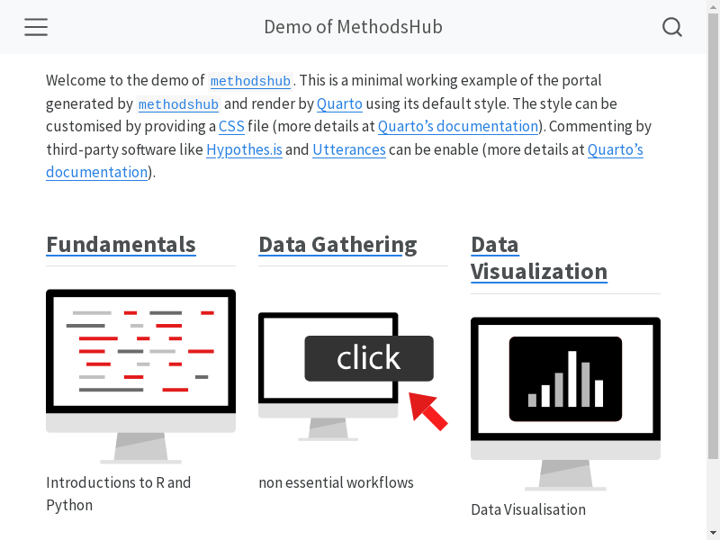
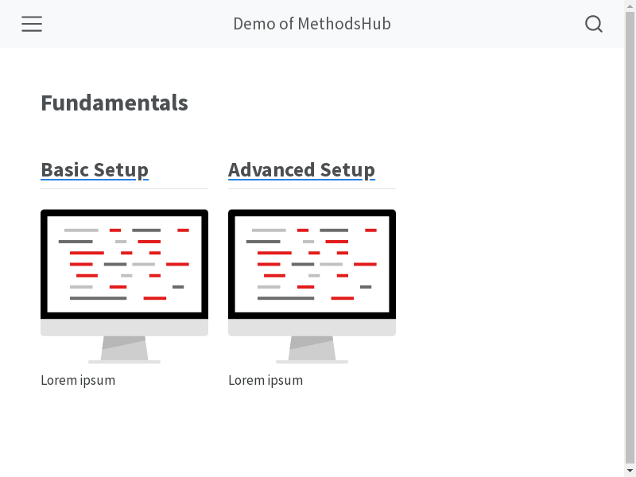
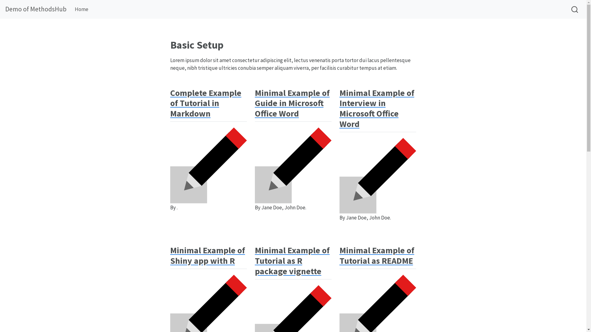
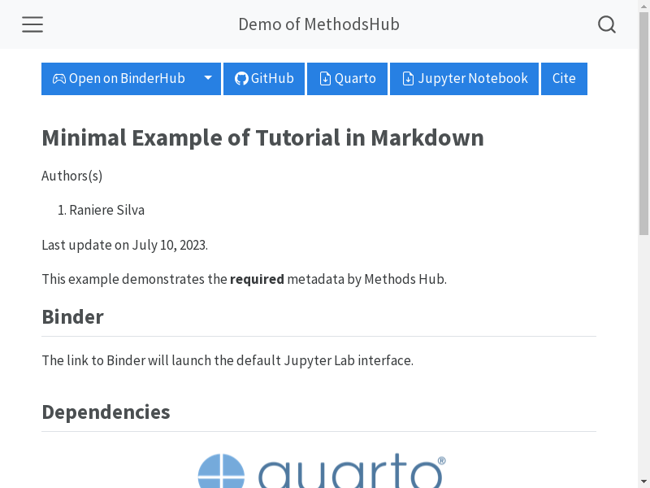

# `methodshub` R package

Create portal from collection of Quarto and Jupyter documents.

The collection is organised in two levels.









## Dependencies

- Quarto >= 1.3
- R
  - devtools
- Python
  - [repo2docker](https://repo2docker.readthedocs.io/)
  - [jupytext](https://jupytext.readthedocs.io/)

### Dependencies installation with `micromamba`

[Check the Contribution Guide](CONTRIBUTING.md#how-to).

## How to Build Demo Portal

```bash
Rscript -e "devtools::load_all(); methodshub::main(source_dir='demo')"
```