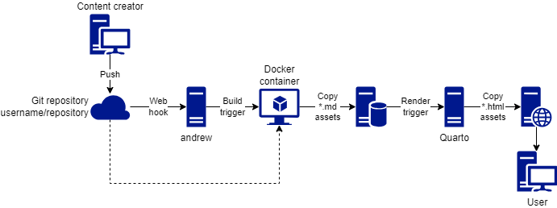

# andrew 

`andrew` (Aggregator for Navigatable Discoverable Reproducible and Educational work) is designed to speed up the creation of a **static** website with pages from a collection of tutorials or vignette of **transparent analytic** computational methods. This is inspired by the feed aggregator Planet. Tutorials and vignette **must** be reproducible and, to enforce it, `andrew` executes the calculations presents in [Jupyter Notebooks](https://nbformat.readthedocs.io/) and [R Markdown](https://rmarkdown.rstudio.com/) files in an [container](https://en.wikipedia.org/wiki/OS-level_virtualization).

The curation of tutorials or vignette that is included in the **static** website can be done using a [sibling project](https://github.com/GESIS-Methods-Hub/andrew-django-admin) or manually editting the CSV files.



The collection is organised in two levels.


## Dependencies

- [Docker](https://www.docker.com/)
- Quarto >= 1.3
- R == 4.2.3 (for remote Intellij development)
- Python
  - [repo2docker](https://repo2docker.readthedocs.io/)

### Dependencies installation

We recommend use [`mamba`](https://mamba.readthedocs.io/) to install the dependencies. A step by step is available at [the Contribution Guide](./CONTRIBUTING.md).

## Install `andrew`

```bash
Rscript -e "devtools::install('GESIS-Methods-Hub/andrew')"
```

## How to Build the Demo Website

```bash
Rscript -e "andrew::main(source_dir='demo')"
```

## Similar Projects

- [R Universe](https://r-universe.dev)
- [Gallery of Jupyter Books](https://executablebooks.org/en/latest/gallery/)
- [`matplotlib` Examples](https://matplotlib.org/stable/gallery/index.html)

## Developer Notes

The file main.R is the entrypoint for the pipeline. It consist of the following steps:

- downloading (cloning the repositories) in download_contributions.R. They will be stored in the repository names without underscore.
- compiling the contributions to markdown and removing all dynamic elements (should be static md afterwards). This is done in render_contributions. 
  1. create a docker container depending on the needs (python R etc.)
  2. run compilation scripts in the container (inst/dockerscripts) to map the different repository types and entry points
  3. copy/using valumes to move the resulting static markdown to the repositories with underscore.  
- automatically create a quarto structure for composing the different repositories into one website
