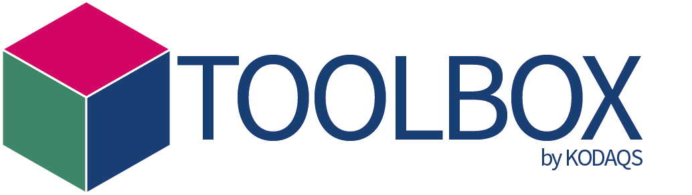

::: {.img-float}
{style="float: left; margin: 5px; width: 40%"}
:::

The **KODAQS Data Quality Toolbox** is an educational resource from the _Competence Center for Data Quality (KODAQS)_, aimed at assisting researchers in developing skills for data quality assessment. It provides tutorials and practical coding examples of key quality indicators to evaluate data across various types—survey, digital behavioral, and linked data—focusing on improving validity and ensuring unbiased research outcomes. Whether handling survey data, digital behavioral data, or linked data, the KODAQS Toolbox guides users in data quality assessments tailored to diverse research interests.

:::{#overview}
:::
