# Introduction

Most network analytic tasks are fairly straightforward to do in R. But
when it comes to visualizing networks, R may lack behind some standalone
software tools. Not because it is not possible to produce nice figures,
but rather because it requires some time to obtain pleasing results.
Just take a look at the default output when plotting a network with the
`plot()` function.

``` r
library(networkdata)
data("got")

gotS1 <- got[[1]]
plot(gotS1)
```

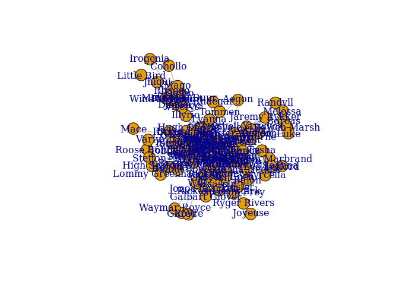

It is definitely possible to produce nice figures with the igraph
package (Check out [this](https://kateto.net/networks-r-igraph)
wonderful tutorial), yet it may take some time to familiarize yourself
with the syntax. Additionally, most of the layout algorithms of `igraph`
are non-deterministic. This means that running the same plot call twice
may produce different results.

In this tutorial, you will learn the basics of `ggraph`, the “`ggplot2`
of networks”, together with the `graphlayouts` package, which introduces
additional useful layout algorithms to R. Arguably, using `ggraph` is
not really easier than `igraph`. But once the underlying principle of
the *grammar of graphics* is understood, you’ll see that it is actually
quite intuitive to work with.

## Required libraries

To run all the code in this tutorial, you need to install and load
several packages.

``` r
install.packages(c("igraph", "graphlayouts", "ggraph","ggforce"))
devtools::install_github("schochastics/networkdata")
```

Make sure you have at least the version given below. Some of the
examples may not be backward compatible.

``` r
packageVersion("igraph")
```

    [1] '1.4.1'

``` r
packageVersion("graphlayouts")
```

    [1] '0.8.4'

``` r
packageVersion("ggraph")
```

    [1] '2.1.0'

``` r
packageVersion("networkdata")
```

    [1] '0.1.15'

``` r
packageVersion("ggforce")
```

    [1] '0.4.1'

`igraph` is mostly used for its data structures and `graphlayouts` and
`ggraph` for visualizations. The `networkdata` package contains a huge
amount of example network data that always comes in handy for learning
new visualization techniques.

``` r
library(igraph)
library(ggraph)
library(graphlayouts)
library(ggforce)
```

## Quick plots

It is always a good idea to take a quick look at your network before
starting any analysis. This can be done with the function `autograph()`
from the `ggraph` package.

``` r
autograph(gotS1)
```

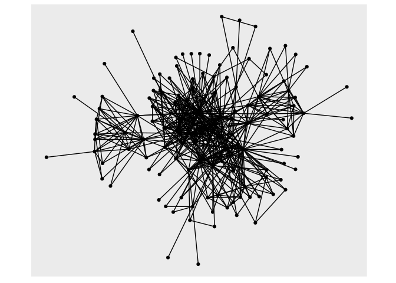

`autograph()` allows you to specify node/edge colours too but it really
is only meant to give you a quick overview without writing a massive
amount of code. Think of it as the `plot()` function for `ggraph`

Before we continue, we add some more node attributes to the GoT network
that can be used during visualization.

``` r
# define a custom color palette
got_palette <- c(
  "#1A5878", "#C44237", "#AD8941", "#E99093",
  "#50594B", "#8968CD", "#9ACD32"
)

# compute a clustering for node colors
V(gotS1)$clu <- as.character(membership(cluster_louvain(gotS1)))

# compute degree as node size
V(gotS1)$size <- degree(gotS1)
```

# The basics of ggraph

Once you move beyond quick plots, you need to understand the basics of,
or at least develop a feeling for, the grammar of graphics to work with
`ggraph`.

Instead of explaining the grammar, let us directly jump into some code
and work through it one line at a time.

``` r
ggraph(gotS1, layout = "stress") +
  geom_edge_link0(aes(edge_width = weight), edge_colour = "grey66") +
  geom_node_point(aes(fill = clu, size = size), shape = 21) +
  geom_node_text(aes(filter = size >= 26, label = name), family = "serif") +
  scale_fill_manual(values = got_palette) +
  scale_edge_width(range = c(0.2, 3)) +
  scale_size(range = c(1, 6)) +
  theme_graph() +
  theme(legend.position = "none")
```

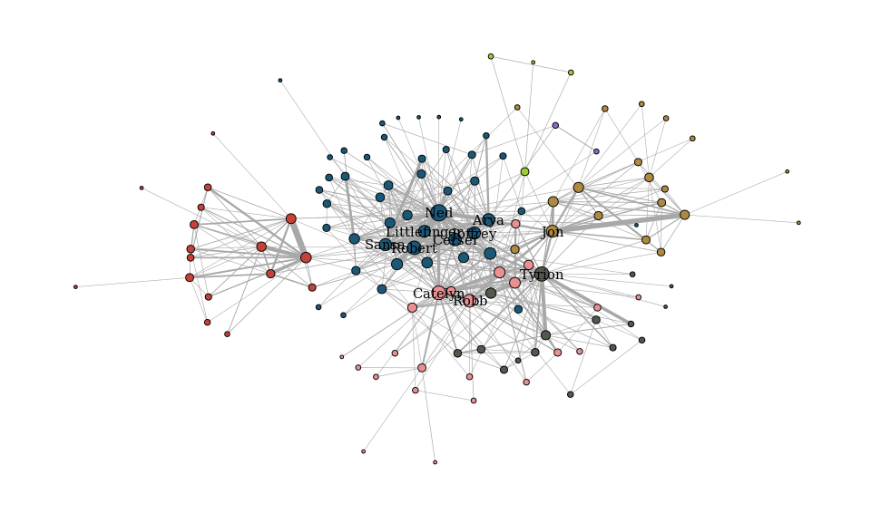

`ggraph` works with layers. Each layer adds a new feature to the plot
and thus builds the figure step-by-step. We will work through each of
the layers separately in the following sections.

## Layout

``` r
ggraph(gotS1, layout = "stress")
```

The first step is to compute a layout. The layout parameter specifies
the algorithm to use. The “stress” layout is part of the `graphlayouts`
package and is always a safe choice since it is deterministic and
produces nice layouts for almost any graph. I would recommend to use it
as your default choice. Other algorithms for, e.g., concentric layouts
and clustered networks are described further down in this tutorial. For
the sake of completeness, here is a list of layout algorithms of
`igraph`.

``` r
c(
  "layout_with_dh", "layout_with_drl", "layout_with_fr",
  "layout_with_gem", "layout_with_graphopt", "layout_with_kk",
  "layout_with_lgl", "layout_with_mds", "layout_with_sugiyama",
  "layout_as_bipartite", "layout_as_star", "layout_as_tree"
)
```

To use them, you just need the last part of the name.

``` r
ggraph(gotS1, layout = "dh") +
  ...
```

Note that there technically is no right or wrong choice. All layout
algorithms are in a sense arbitrary since we can choose x and y
coordinates freely (compare this to ordinary data!). It is all mostly
about aesthetics.

You can also precompute the layout with the `create_layout()` function.
This makes sense in cases where the calculation of the layout takes very
long and you want to play around with other visual aspects.

``` r
gotS1_layout <- create_layout(gotS1 = "stress")

ggraph(gotS1_layout) +
  ...
```

## Edges

``` r
geom_edge_link0(aes(width = weight), edge_colour = "grey66")
```

The second layer specifies how to draw the edges. Edges can be drawn in
many different ways as the list below shows.

``` r
c(
  "geom_edge_arc", "geom_edge_arc0", "geom_edge_arc2", "geom_edge_density",
  "geom_edge_diagonal", "geom_edge_diagonal0", "geom_edge_diagonal2",
  "geom_edge_elbow", "geom_edge_elbow0", "geom_edge_elbow2", "geom_edge_fan",
  "geom_edge_fan0", "geom_edge_fan2", "geom_edge_hive", "geom_edge_hive0",
  "geom_edge_hive2", "geom_edge_link", "geom_edge_link0", "geom_edge_link2",
  "geom_edge_loop", "geom_edge_loop0"
)
```

You can do a lot of fancy things with these `geoms` but for a standard
network plot, you should always stick with `geom_edge_link0` since it
simply draws a straight line between the endpoints. Some tools draw
curved edges by default. While this may add some artistic value, it
reduces readability. Always go with straight lines! If your network has
multiple edges between two nodes, then you can switch to
`geom_edge_parallel()`.

In case you are wondering what the “0” stands for: The standard
`geom_edge_link()` draws 100 dots on each edge compared to only two dots
(the endpoints) in `geom_edge_link0()`. This is done to allow, e.g.,
gradients along the edge.

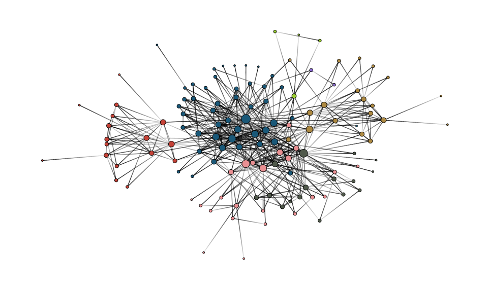

You can reproduce this figure by substituting

``` r
geom_edge_link(aes(edge_alpha = ..index..), edge_colour = "black")
```

in the code above.

The drawback of using `geom_edge_link()` is that the time to render the
plot increases and so does the size of the file if you export the plot
([example](https://twitter.com/schochastics/status/1091355396265201664))
Typically, you do not need gradients along an edge. Hence,
`geom_edge_link0()` should be your default choice to draw edges.

Within `geom_edge_link0`, you can specify the appearance of the edge,
either by mapping edge attributes to aesthetics or setting them globally
for the graph. Mapping attributes to aesthetics is done within `aes()`.
In the example, we map the edge width to the edge attribute “weight”.
`ggraph` then automatically scales the edge width according to the
attribute. The colour of all edges is globally set to “grey66”.

The following aesthetics can be used within `geom_edge_link0` either
within `aes()` or globally:

-   edge_colour (colour of the edge)
-   edge_width (width of the edge)
-   edge_linetype (linetype of the edge, defaults to “solid”)
-   edge_alpha (opacity; a value between 0 and 1)

`ggraph` does not automatically draw arrows if your graph is directed.
You need to do this manually using the arrow parameter.

``` r
geom_edge_link0(aes(...), ...,
  arrow = arrow(
    angle = 30, length = unit(0.15, "inches"),
    ends = "last", type = "closed"
  )
)
```

The default arrowhead type is “open”, yet “closed” usually has a nicer
appearance.

## Nodes

``` r
geom_node_point(aes(fill = clu, size = size), shape = 21) +
  geom_node_text(aes(filter = size >= 26, label = name), family = "serif")
```

On top of the edge layer, we draw the node layer. Always draw the node
layer above the edge layer. Otherwise, edges will be visible on top of
nodes. There are slightly less geoms available for nodes.

``` r
c(
  "geom_node_arc_bar", "geom_node_circle", "geom_node_label",
  "geom_node_point", "geom_node_text", "geom_node_tile", "geom_node_treemap"
)
```

The most important ones here are `geom_node_point()` to draw nodes as
simple geometric objects (circles, squares,…) and `geom_node_text()` to
add node labels. You can also use `geom_node_label()`, but this draws
labels within a box.

The mapping of node attributes to aesthetics is similar to edge
attributes. In the example code, we map the fill attribute of the node
shape to the “clu” attribute, which holds the result of a clustering,
and the size of the nodes to the attribute “size”. The shape of the node
is globally set to 21.

The figure below shows all possible shapes that can be used for the
nodes.

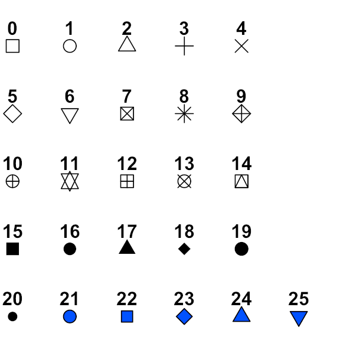

Personally, I prefer “21” since it draws a border around the nodes. If
you prefer another shape, say “19”, you have to be aware of several
things. To change the color of shapes 1-20, you need to use the colour
parameter. For shapes 21-25 you need to use fill. The colour parameter
only controls the border for these cases.

The following aesthetics can be used within `geom_node_point()` either
within `aes()` or globally:

-   alpha (opacity; a value between 0 and 1)
-   colour (colour of shapes 0-20 and border colour for 21-25)
-   fill (fill colour for shape 21-25)
-   shape (node shape; a value between 0 and 25)
-   size (size of node)
-   stroke (size of node border)

For `geom_node_text()`, there are a lot more options available, but the
most important once are:

-   label (attribute to be displayed as node label)
-   colour (text colour)
-   family (font to be used)
-   size (font size)

Note that we also used a filter within `aes()` of `geom_node_text()`.
The filter parameter allows you to specify a rule for when to apply the
aesthetic mappings. The most frequent use case is for node labels (but
can also be used for edges or nodes). In the example, we only display
the node label if the size attribute is larger than 26.

## Scales

``` r
scale_fill_manual(values = got_palette) +
  scale_edge_width_continuous(range = c(0.2, 3)) +
  scale_size_continuous(range = c(1, 6))
```

The `scale_*` functions are used to control aesthetics that are mapped
within `aes()`. You do not necessarily need to set them, since `ggraph`
can take care of it automatically.

``` r
ggraph(gotS1, layout = "stress") +
  geom_edge_link0(aes(edge_width = weight), edge_colour = "grey66") +
  geom_node_point(aes(fill = clu, size = size), shape = 21) +
  geom_node_text(aes(filter = size >= 26, label = name), family = "serif") +
  theme_graph() +
  theme(legend.position = "none")
```

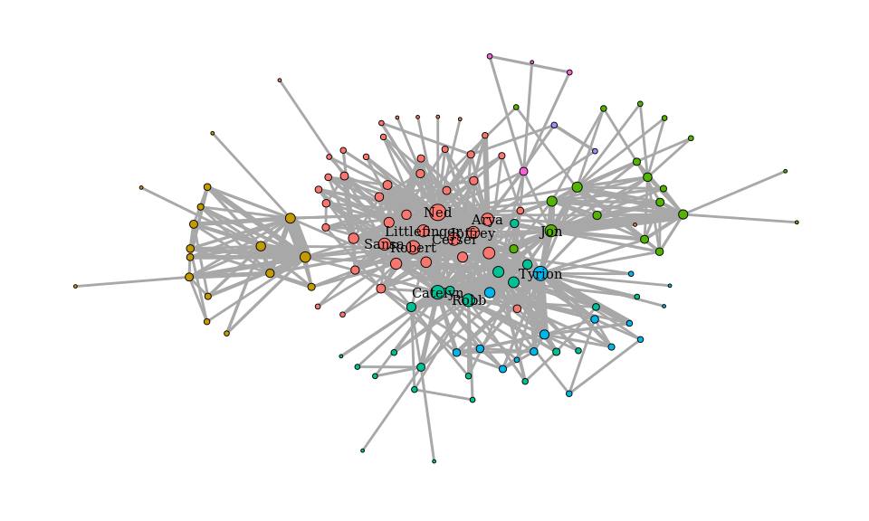

While the node fill and size seem reasonable, the edges are a little too
thick. In general, it is always a good idea to add a `scale_*` for each
aesthetic within `aes()`.

What kind of `scale_*` function you need depends on the aesthetic and on
the type of attribute you are mapping. Generally, scale functions are
structured like this:  
`scale_<aes>_<variable type>()`.

The “aes” part is easy. Just us the type you specified within `aes()`.
For edges, however, you have to prepend `edge_`. The “variable type”
part depends on which scale the attribute is on. Before we continue, it
may be a good idea to briefly discuss what aesthetics make sense for
which variable type.

<table>
<colgroup>
<col style="width: 25%" />
<col style="width: 31%" />
<col style="width: 43%" />
</colgroup>
<thead>
<tr class="header">
<th>aesthetic</th>
<th>variable type</th>
<th>notes</th>
</tr>
</thead>
<tbody>
<tr class="odd">
<td>node size</td>
<td>continuous</td>
<td></td>
</tr>
<tr class="even">
<td>edge width</td>
<td>continuous</td>
<td></td>
</tr>
<tr class="odd">
<td>node colour/fill</td>
<td>categorical/continuous</td>
<td>use a gradient for continuous variables</td>
</tr>
<tr class="even">
<td>edge colour</td>
<td>continuous</td>
<td>categorical only if there are different types of edges</td>
</tr>
<tr class="odd">
<td>node shape</td>
<td>categorical</td>
<td>only if there are a few categories (1-5). Colour should be the
preferred choice</td>
</tr>
<tr class="even">
<td>edge linetype</td>
<td>categorical</td>
<td>only if there are a few categories (1-5). Colour should be the
preferred choice</td>
</tr>
<tr class="odd">
<td>node/edge alpha</td>
<td>continuous</td>
<td></td>
</tr>
</tbody>
</table>

The easiest to use scales are those for continuous variables mapped to
edge width and node size (also the alpha value, which is not used here).
While there are several parameters within
`scale_edge_width_continuous()` and `scale_size_continuous()`, the most
important one is “range” which fixes the minimum and maximum width/size.
It usually suffices to adjust this parameter.

For continuous variables that are mapped to node/edge colour, you can
use `scale_colour_gradient()` `scale_colour_gradient2()` or
`scale_colour_gradientn()` (add edge\_ before colour for edge colours).
The difference between these functions is in how the gradient is
constructed. `gradient` creates a two colour gradient (low-high). Simply
specify the the two colours to be used (e.g. low = “blue”, high =
“red”). `gradient2` creates a diverging colour gradient (low-mid-high)
(e.g. low = “blue”, mid = “white”, high = “red”) and `gradientn` a
gradient consisting of more than three colours (specified with the
colours parameter).

For categorical variables that are mapped to node colours (or fill in
our example), you can use `scale_fill_manual()`. This forces you to
choose a color for each category yourself. Simply create a vector of
colors (see the got_palette) and pass it to the function with the
parameter values.

`ggraph` then assigns the colors in the order of the unique values of
the categorical variable. This are either the factor levels (if the
variable is a factor) or the result of sorting the unique values (if the
variable is a character).

``` r
sort(unique(V(gotS1)$clu))
```

    [1] "1" "2" "3" "4" "5" "6" "7"

If you want more control over which value is mapped to which colour, you
can pass the vector of colours as a named vector.

``` r
got_palette2 <- c(
  "5" = "#1A5878", "3" = "#C44237", "2" = "#AD8941",
  "1" = "#E99093", "4" = "#50594B", "7" = "#8968CD", "6" = "#9ACD32"
)
```

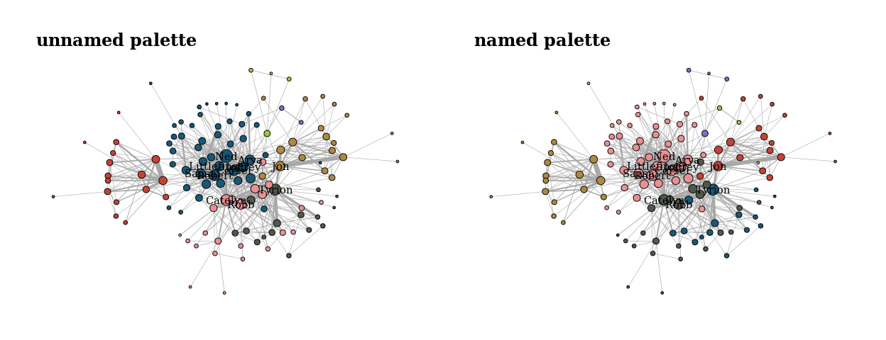

Using your own colour palette gives your network a unique touch. If you
can’t be bothered with choosing colours, you may want to consider
`scale_fill_brewer()` and `scale_colour_brewer()`. The function offers
all palettes available at [colorbrewer2.org](http://colorbrewer2.org/).

``` r
ggraph(gotS1, layout = "stress") +
  geom_edge_link0(aes(edge_width = weight), edge_colour = "grey66") +
  geom_node_point(aes(fill = clu, size = size), shape = 21) +
  geom_node_text(aes(filter = size >= 26, label = name), family = "serif") +
  scale_fill_brewer(palette = "Dark2") +
  scale_edge_width_continuous(range = c(0.2, 3)) +
  scale_size_continuous(range = c(1, 6)) +
  theme_graph() +
  theme(legend.position = "none")
```

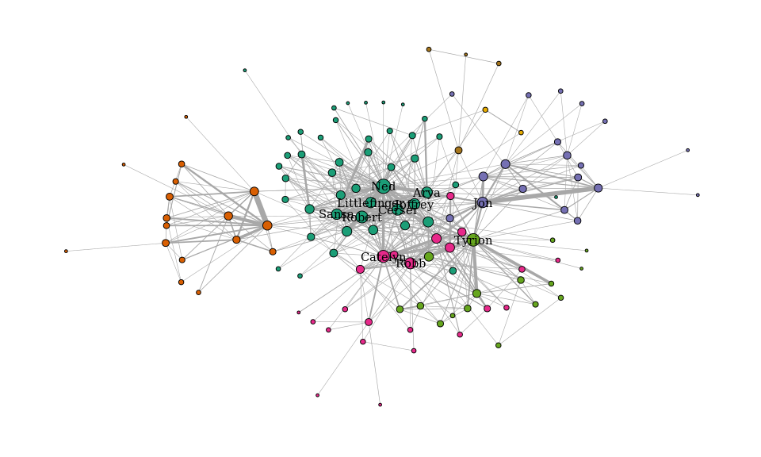

(*Check out this [github
repo](https://github.com/EmilHvitfeldt/r-color-palettes) from Emil
Hvitfeldt for a comprehensive list of color palettes available in R*)

## Themes

``` r
theme_graph() +
  theme(legend.position = "none")
```

themes control the overall look of the plot. There are a lot of options
within the `theme()` function of `ggplot2`. Luckily, we really don’t
need any of those. `theme_graph()` is used to erase all of the default
ggplot theme (e.g. axis, background, grids, etc.) since they are
irrelevant for networks. The only option worthwhile in `theme()` is
`legend.position`, which we set to “none”, i.e. don’t show the legend.

The code below gives an example for a plot with a legend.

``` r
ggraph(gotS1, layout = "stress") +
  geom_edge_link0(aes(edge_width = weight), edge_colour = "grey66") +
  geom_node_point(aes(fill = clu, size = size), shape = 21) +
  geom_node_text(aes(filter = size >= 26, label = name), family = "serif") +
  scale_fill_manual(values = got_palette) +
  scale_edge_width_continuous(range = c(0.2, 3)) +
  scale_size_continuous(range = c(1, 6)) +
  theme_graph() +
  theme(legend.position = "bottom",
    plot.title = element_text(family = "serif"),
    legend.text = element_text(family = "serif"),
    legend.title = element_text(family = "serif"))
```

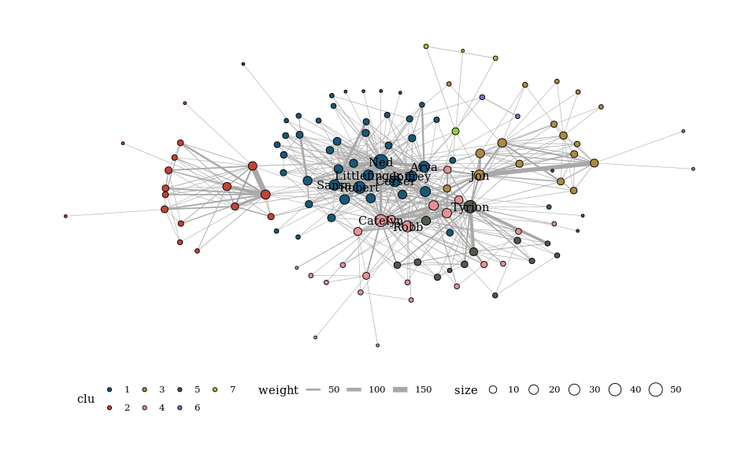

# Another full example

Let us work through one more visualization using a very special data
set. The “Grey’s Anatomy” hook-up network

``` r
data("greys")
```

Start with the `autograph` call.

``` r
autograph(greys)
```

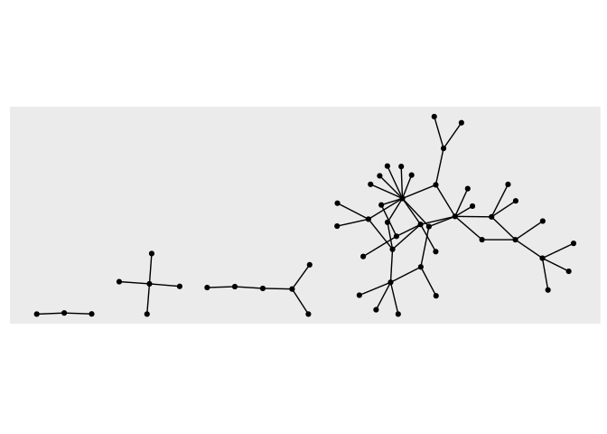

The network consists of several components. Note that the igraph
standard is to pack all components in a circle. The standard in
`graphlayouts` is to arrange them in a rectangle. You can specify the
`bbox` parameter to arrange the components differently. The plot above
arranges all components on one level, but two levels may be desirable.
You may need to experiment a bit with the parameter, but for this
network, `bbox=15` seems to work best (see below).

We will use this network to quickly illustrate what can be done with
`geom_edge_link2()`. The function allows to interpolate node attributes
between the start and end node along the edges. In the code below, we
use the “position” attribute. The line which adds the node labels
illustrates two further features of `ggraph`. First, aesthetics don’t
need to be node attributes. Here, for instance, we calculate the degree
and then map it to the font size. The second one is the `repel = TRUE`
argument. This option places the node labels in a way that labels do not
overlap.

``` r
ggraph(greys, "stress", bbox = 15) +
  geom_edge_link2(aes(edge_colour = node.position), edge_width = 0.5) +
  geom_node_point(aes(fill = sex), shape = 21, size = 3) +
  geom_node_text(aes(label = name, size = degree(greys)),
    family = "serif", repel = TRUE
  ) +
  scale_edge_colour_brewer(palette = "Set1") +
  scale_fill_manual(values = c("grey66", "#EEB422", "#424242")) +
  scale_size(range = c(2, 5), guide = "none") +
  theme_graph() +
  theme(legend.position = "bottom",
    plot.title = element_text(family = "serif"),
    legend.text = element_text(family = "serif"),
    legend.title = element_text(family = "serif"))
```

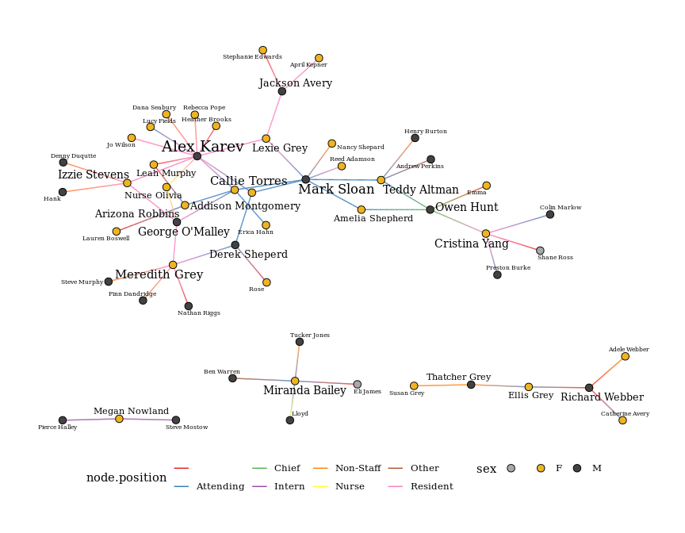

While the coloured edges look kind of artistic, we should go back to the
“0” version.

``` r
ggraph(greys, "stress", bbox = 15) +
  geom_edge_link0(edge_colour = "grey66", edge_width = 0.5) +
  geom_node_point(aes(fill = sex), shape = 21, size = 3) +
  geom_node_text(aes(label = name, size = degree(greys)),
    family = "serif", repel = TRUE
  ) +
  scale_fill_manual(values = c("grey66", "#EEB422", "#424242")) +
  scale_size(range = c(2, 5), guide = "none") +
  theme_graph() +
  theme(legend.position = "bottom",
    plot.title = element_text(family = "serif"),
    legend.text = element_text(family = "serif"),
    legend.title = element_text(family = "serif"))
```

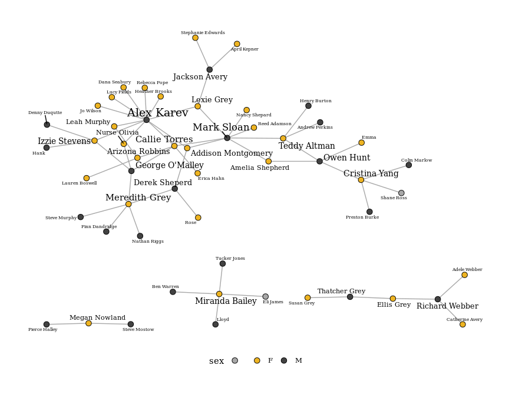

# Code through: Recreate the polblogs viz

<details>
<summary>
Expand
</summary>

In this section, we do a little code through to recreate the figure
shown below.

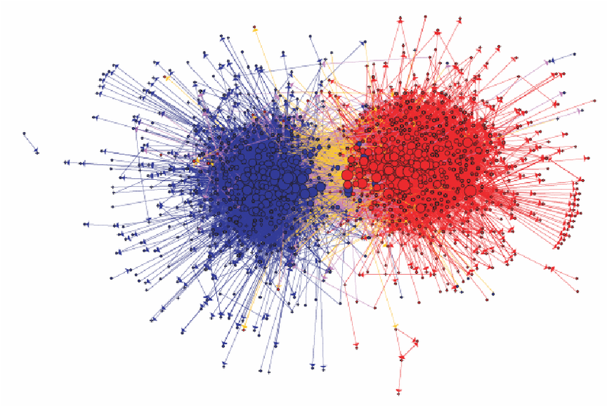 The network shows the linking between political
blogs during the 2004 election in the US. Red nodes are conservative
leaning blogs and blue ones liberal.

The dataset is included in the `networkdata` package.

``` r
data("polblogs")

# add a vertex attribute for the indegree
V(polblogs)$deg <- degree(polblogs, mode = "in")
```

Let us start with a simple plot without any styling.

``` r
lay <- create_layout(polblogs, "stress")

ggraph(lay) +
  geom_edge_link0(
    edge_width = 0.2, edge_colour = "grey66",
    arrow = arrow(
      angle = 15, length = unit(0.15, "inches"),
      ends = "last", type = "closed"
    )
  ) +
  geom_node_point()
```

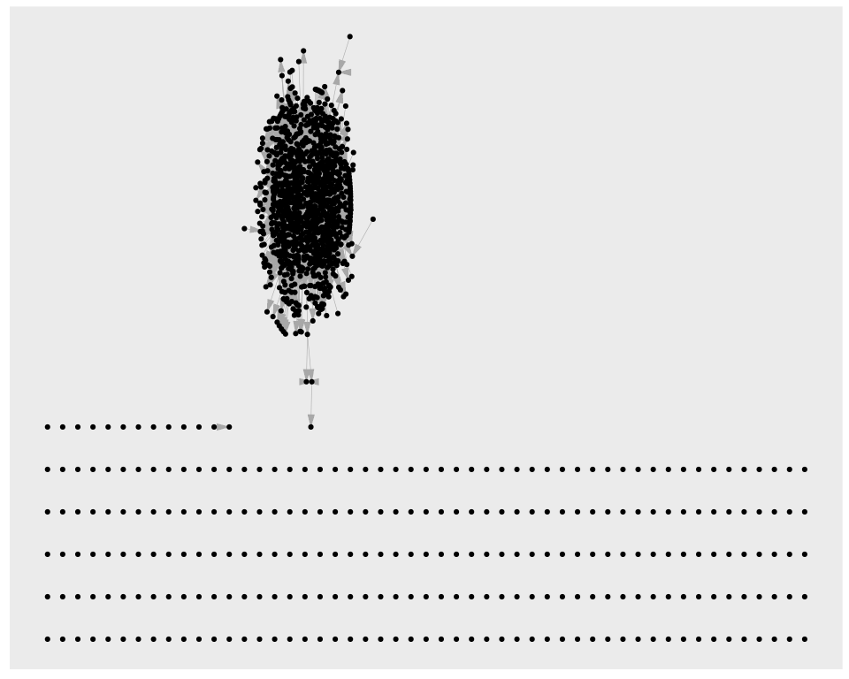

There is obviously a lot missing. First, we delete all isolates and plot
again.

``` r
polblogs <- delete.vertices(polblogs, which(degree(polblogs) == 0))
lay <- create_layout(polblogs, "stress")

ggraph(lay) +
  geom_edge_link0(
    edge_width = 0.2, edge_colour = "grey66",
    arrow = arrow(
      angle = 15, length = unit(0.1, "inches"),
      ends = "last", type = "closed"
    )
  ) +
  geom_node_point()
```

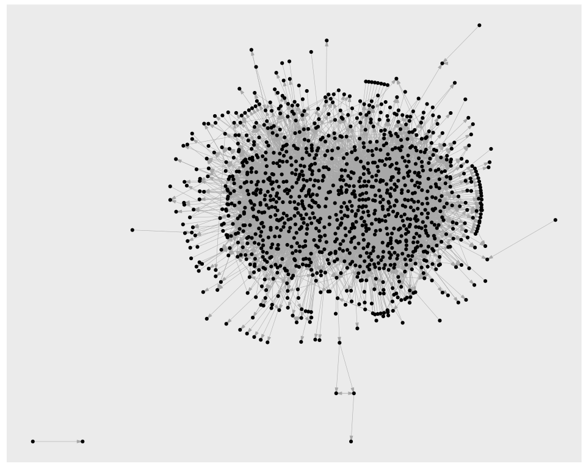

The original does feature a small disconnected component, but we remove
this here.

``` r
comps <- components(polblogs)
polblogs <- delete.vertices(polblogs, which(comps$membership == which.min(comps$csize)))

lay <- create_layout(polblogs, "stress")
ggraph(lay) +
  geom_edge_link0(
    edge_width = 0.2, edge_colour = "grey66",
    arrow = arrow(
      angle = 15, length = unit(0.15, "inches"),
      ends = "last", type = "closed"
    )
  ) +
  geom_node_point()
```

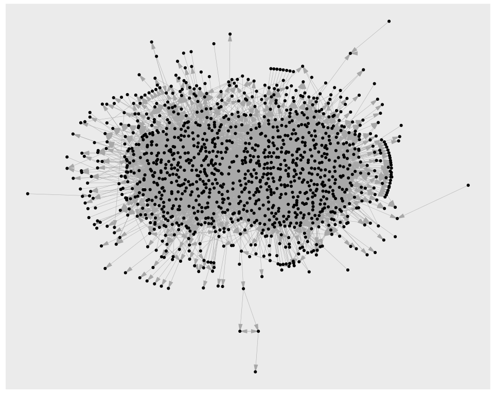

Better, let’s start with some styling of the nodes.

``` r
ggraph(lay) +
  geom_edge_link0(
    edge_width = 0.2, edge_colour = "grey66",
    arrow = arrow(
      angle = 15, length = unit(0.15, "inches"),
      ends = "last", type = "closed"
    )
  ) +
  geom_node_point(shape = 21, aes(fill = pol))
```

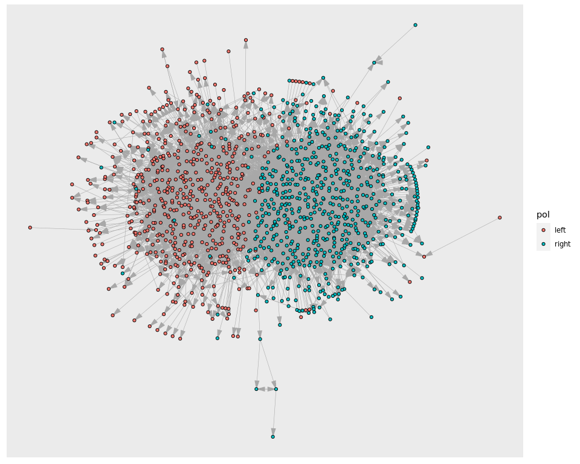

The colors are obviously wrong, so we fix this with a
`scale_fill_manual()`. Additionally, we map the degree to node size.

``` r
ggraph(lay) +
  geom_edge_link0(
    edge_width = 0.2, edge_colour = "grey66",
    arrow = arrow(
      angle = 15, length = unit(0.15, "inches"),
      ends = "last", type = "closed"
    )
  ) +
  geom_node_point(shape = 21, aes(fill = pol, size = deg), show.legend = FALSE) +
  scale_fill_manual(values = c("left" = "#104E8B", "right" = "firebrick3"))
```

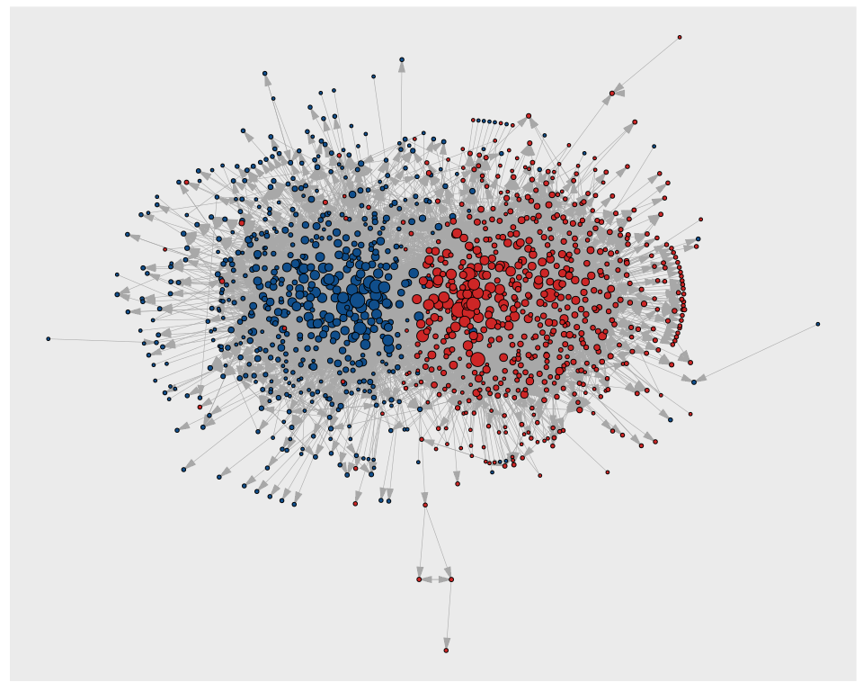

The node sizes are also not that satisfactory, so we fix the range with
`scale_size()`.

``` r
ggraph(lay) +
  geom_edge_link0(
    edge_width = 0.2, edge_colour = "grey66",
    arrow = arrow(
      angle = 10, length = unit(0.1, "inches"),
      ends = "last", type = "closed"
    )
  ) +
  geom_node_point(shape = 21, aes(fill = pol, size = deg), show.legend = FALSE) +
  scale_fill_manual(values = c("left" = "#104E8B", "right" = "firebrick3")) +
  scale_size(range = c(0.5, 7))
```

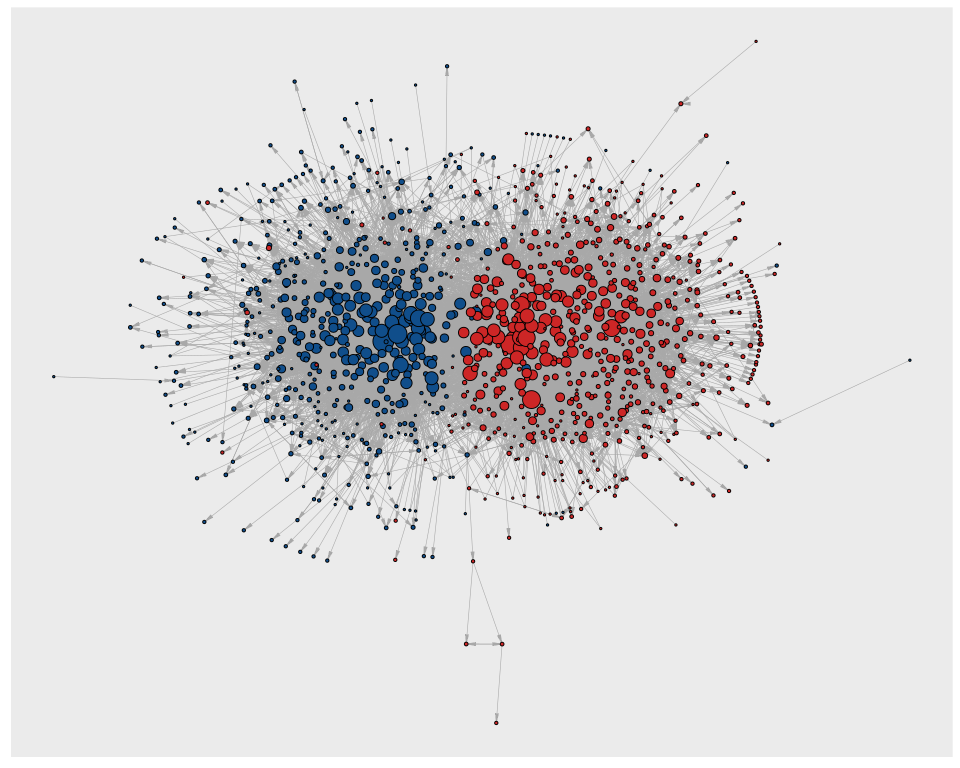

Now we move on to the edges. This is a bit more complicated since we
have to create an edge variable first which indicates if an edge is
within or between political orientations. This new variable is mapped to
the edge color.

``` r
el <- get.edgelist(polblogs, names = FALSE)
el_pol <- cbind(V(polblogs)$pol[el[, 1]], V(polblogs)$pol[el[, 2]])
E(polblogs)$col <- ifelse(el_pol[, 1] == el_pol[, 2], el_pol[, 1], "mixed")


lay <- create_layout(polblogs, "stress")
ggraph(lay) +
  geom_edge_link0(
    edge_width = 0.2, aes(edge_colour = col),
    arrow = arrow(
      angle = 10, length = unit(0.1, "inches"),
      ends = "last", type = "closed"
    )
  ) +
  geom_node_point(shape = 21, aes(fill = pol, size = deg), show.legend = FALSE) +
  scale_fill_manual(values = c("left" = "#104E8B", "right" = "firebrick3")) +
  scale_size(range = c(0.5, 7))
```

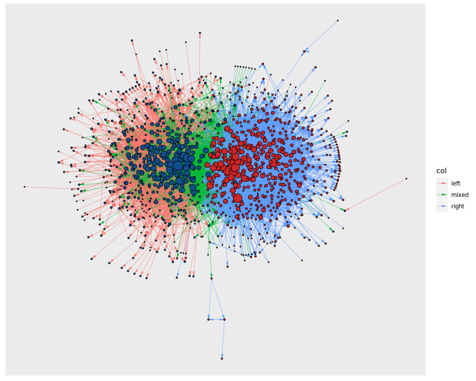

Similar to the node colors, we add a `scale_edge_colour_manual()` to
adjust the edge colors.

``` r
ggraph(lay) +
  geom_edge_link0(
    edge_width = 0.2, aes(edge_colour = col),
    arrow = arrow(
      angle = 10, length = unit(0.1, "inches"),
      ends = "last", type = "closed"
    ), show.legend = FALSE
  ) +
  geom_node_point(shape = 21, aes(fill = pol, size = deg), show.legend = FALSE) +
  scale_fill_manual(values = c("left" = "#104E8B", "right" = "firebrick3")) +
  scale_edge_colour_manual(values = c("left" = "#104E8B", "mixed" = "goldenrod", "right" = "firebrick3")) +
  scale_size(range = c(0.5, 7))
```

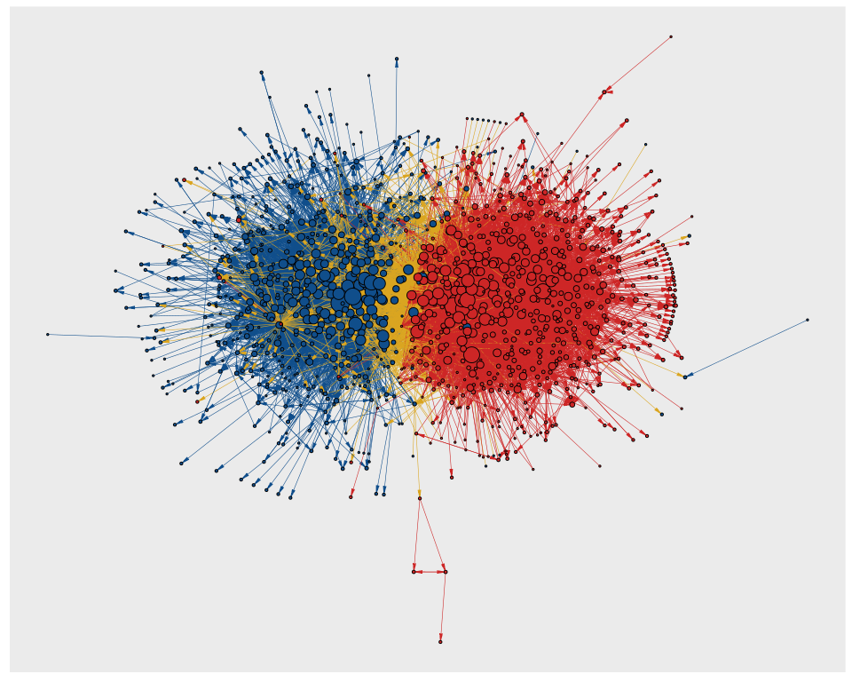

Almost, but it seems there are a lot of yellow edges which run over blue
edges. It looks as if these should run below according to the original
viz. To achieve this, we use a filter trick. We add two
`geom_edge_link0()` layers: First, for the mixed edges and then for the
remaining edges. In that way, the mixed edges are getting plotted below.

``` r
ggraph(lay) +
  geom_edge_link0(
    edge_width = 0.2, aes(filter = (col == "mixed"), edge_colour = col),
    arrow = arrow(
      angle = 10, length = unit(0.1, "inches"),
      ends = "last", type = "closed"
    ), show.legend = FALSE
  ) +
  geom_edge_link0(
    edge_width = 0.2, aes(filter = (col != "mixed"), edge_colour = col),
    arrow = arrow(
      angle = 10, length = unit(0.1, "inches"),
      ends = "last", type = "closed"
    ), show.legend = FALSE
  ) +
  geom_node_point(shape = 21, aes(fill = pol, size = deg), show.legend = FALSE) +
  scale_fill_manual(values = c("left" = "#104E8B", "right" = "firebrick3")) +
  scale_edge_colour_manual(values = c("left" = "#104E8B", "mixed" = "goldenrod", "right" = "firebrick3")) +
  scale_size(range = c(0.5, 7))
```

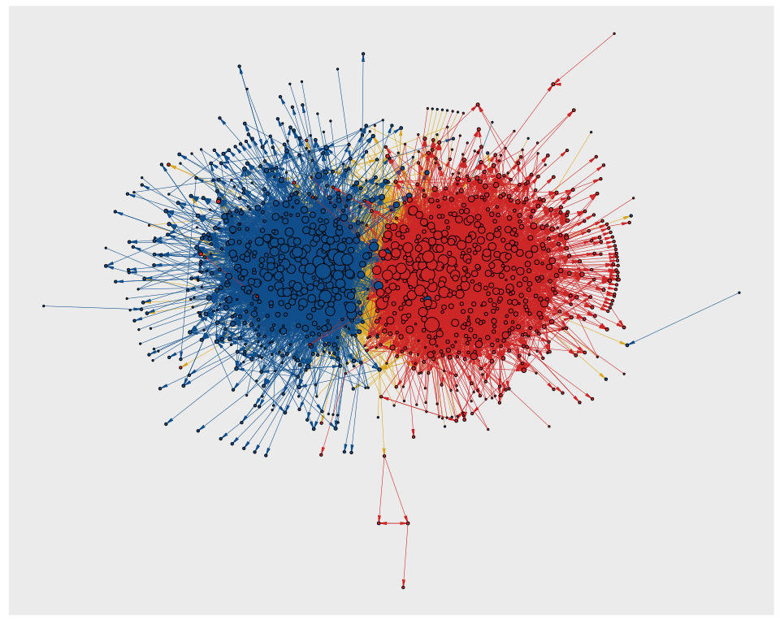

Now lets just add the `theme_graph()`.

``` r
ggraph(lay) +
  geom_edge_link0(
    edge_width = 0.2, aes(filter = (col == "mixed"), edge_colour = col),
    arrow = arrow(
      angle = 10, length = unit(0.1, "inches"),
      ends = "last", type = "closed"
    ), show.legend = FALSE
  ) +
  geom_edge_link0(
    edge_width = 0.2, aes(filter = (col != "mixed"), edge_colour = col),
    arrow = arrow(
      angle = 10, length = unit(0.1, "inches"),
      ends = "last", type = "closed"
    ), show.legend = FALSE
  ) +
  geom_node_point(shape = 21, aes(fill = pol, size = deg), show.legend = FALSE) +
  scale_fill_manual(values = c("left" = "#104E8B", "right" = "firebrick3")) +
  scale_edge_colour_manual(values = c("left" = "#104E8B", "mixed" = "goldenrod", "right" = "firebrick3")) +
  scale_size(range = c(0.5, 7)) +
  theme_graph()
```

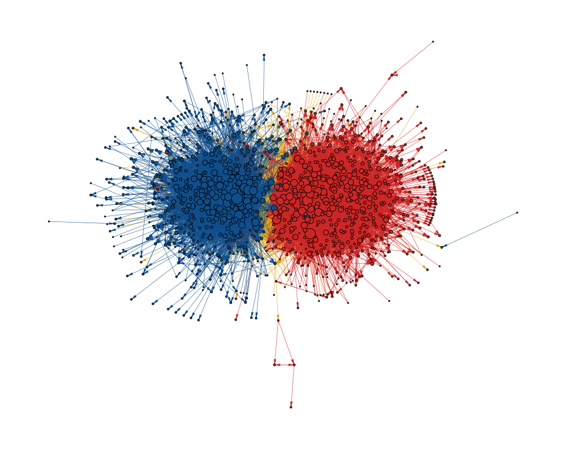

That’s it!

</details>

# Miscellaneous

Everything we covered above should be enough to produce nice network
visualizations for scientific publications. However, `ggraph` has a lot
more advanced functions/parameter settings to further enhance your
visualization. If you are looking for something specific, it is always a
good idea to read the documentation of the geoms.

Some things that I frequently use are the following:

-   change the `end_cap` in `geom_edge_link()` to end edges before
    reaching the node. This is helpful for directed edges to not make
    the arrows disappear.
-   `legend.position` in `theme()` controls all legends at once. If you
    don’t want to show a specific legend, use `guide = "none"` in the
    respective `scale_*` function.
-   use `scale_color_viridis_c()` and `scale_color_viridis_d()`. The
    viridis colour palette makes plots easier to read by those with
    colorblindness and print well in grey scale.

The stress layout also works well with medium to large graphs.

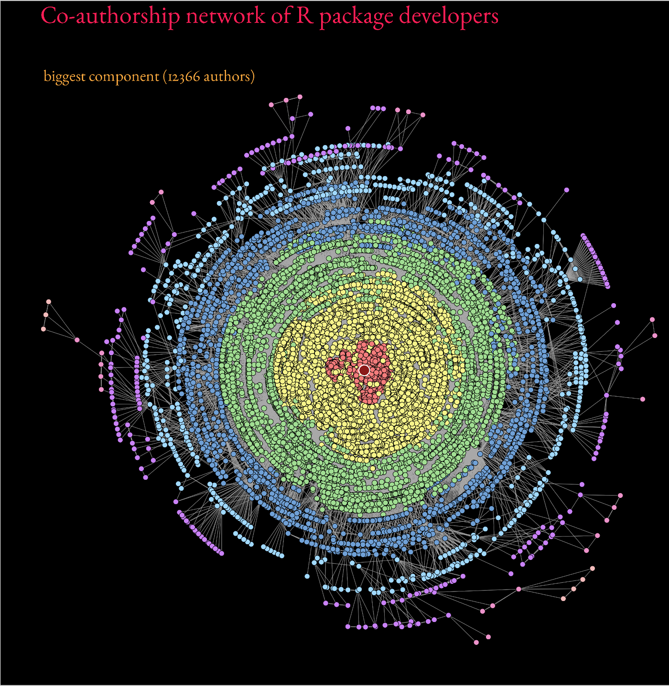

The network shows the biggest componentn of the co-authorship network of
R package developers on CRAN (~12k nodes)

If you want to go beyond ~20k nodes, then you may want to switch to
`layout_with_pmds()` or `layout_with_sparse_stress()` which are
optimized to work with large graphs.

## use the ggforce

The `ggforce` package works pretty nicely with `ggraph`. You can, for
instance, use the `geom_mark_*()` functions to highlight clusters.

``` r
set.seed(665)

#create network with a group structure
g <- sample_islands(9, 40, 0.4, 15)
g <- igraph::simplify(g)
V(g)$grp <- as.character(rep(1:9, each = 40))

bb <- layout_as_backbone(g, keep = 0.4)
E(g)$col <- F
E(g)$col[bb$backbone] <- T
```

``` r
ggraph(g,
       layout = "manual",
       x = bb$xy[, 1],
       y = bb$xy[, 2]) +
  geom_edge_link0(aes(col = col), width = 0.2) +
  geom_node_point(aes(fill = grp), shape = 21, size = 3) +
  geom_mark_hull(
    aes(x, y, group = grp, fill = grp),
    concavity = 4,
    expand = unit(2, "mm"),
    alpha = 0.25
  ) +
  scale_color_brewer(palette = "Set1") +
  scale_fill_brewer(palette = "Set1") +
  scale_edge_color_manual(values = c(rgb(0, 0, 0, 0.3), rgb(0, 0, 0, 1))) +
  theme_graph()+
  theme(legend.position = "none")
```

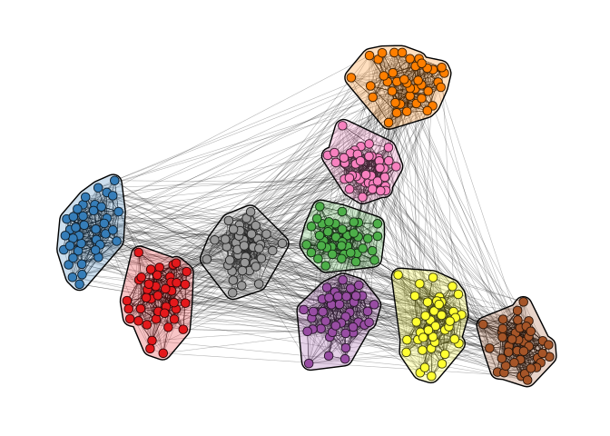

Of course you can also add a label to your clusters.

``` r
ggraph(g,
       layout = "manual",
       x = bb$xy[, 1],
       y = bb$xy[, 2]) +
  geom_edge_link0(aes(col = col), width = 0.2) +
  geom_node_point(aes(fill = grp), shape = 21, size = 3) +
  geom_mark_hull(
    aes(x, y, group = grp, fill = grp, label=grp),
    concavity = 4,
    expand = unit(2, "mm"),
    alpha = 0.25
  ) +
  scale_color_brewer(palette = "Set1") +
  scale_fill_brewer(palette = "Set1") +
  scale_edge_color_manual(values = c(rgb(0, 0, 0, 0.3), rgb(0, 0, 0, 1))) +
  theme_graph()+
  theme(legend.position = "none")
```


If you want to avoid node overlaps, you can use `geom_node_voronoi()`.
So this is actually already implemented in {{ggraph}}, but originates
from `geom_voronoi_tile()`.

``` r
ggraph(g,
       layout = "manual",
       x = bb$xy[, 1],
       y = bb$xy[, 2]) +
  geom_edge_link0(aes(filter = !col, col = col), width = 0.2) +
  geom_node_voronoi(
    aes(x, y, fill = grp),
    max.radius = 0.4,
    expand = unit(-0.5, 'mm'),
    colour = 'black'
  ) +
  scale_color_brewer(palette = "Set1") +
  scale_fill_brewer(palette = "Set1") +
  scale_edge_color_manual(values = c(rgb(0, 0, 0, 0.3), rgb(0, 0, 0, 1))) +
  theme(
    legend.position = "none",
    panel.grid = element_blank(),
    axis.ticks = element_blank(),
    axis.text = element_blank()
  ) +
  theme_graph() +
  theme(legend.position = "none")
```

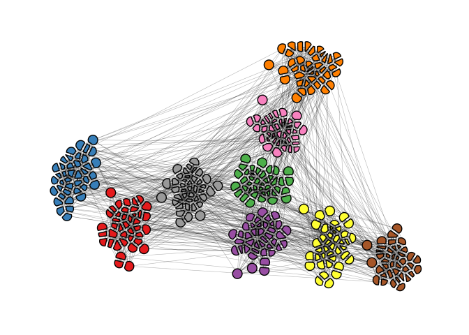

# FAQ

I compiled some more specific tips in a [blog
post](http://blog.schochastics.net/post/ggraph-tricks-for-common-problems/)
a while ago. I will highlight some FAQ from that post belo (I will
update this section with more tips and tricks).

> “How can I achieve that my directed edges stop at the node border,
> independent from the node size?”

This one has given me headaches for the longest time. No matter what I
tried, I always ended up with something like the below plot.

``` r
# create a random network
set.seed(1071)
g <- sample_pa(30, 1)
V(g)$degree <- degree(g, mode = "in")

ggraph(g, "stress") +
  geom_edge_link(
    aes(end_cap = circle(node2.degree + 2, "pt")),
    edge_colour = "black",
    arrow = arrow(
      angle = 10,
      length = unit(0.15, "inches"),
      ends = "last",
      type = "closed"
    )
  ) +
  geom_node_point(aes(size = degree), col = "grey66", show.legend = FALSE) +
  scale_size(range = c(3, 11)) +
  theme_graph()
```

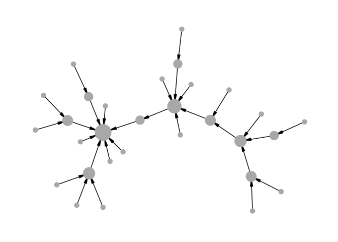

The overlap can be avoided by using the `I()` function from base R,
which treats the entries of a vector “as is”. So we know that if a node
has degree 5, it will be mapped to a circle with radius (or diameter?)
“5pt”. Since this means, that you have no control over the scaling, you
need to do that beforehand.

``` r
# this function is borrowed from the ambient package
normalise <- function(x, from = range(x), to = c(0, 1)) {
  x <- (x - from[1]) / (from[2] - from[1])
  if (!identical(to, c(0, 1))) {
    x <- x * (to[2] - to[1]) + to[1]
  }
  x
}

# map to the range you want
V(g)$degree <- normalise(V(g)$degree, to = c(3, 11))

ggraph(g, "stress") +
  geom_edge_link(
    aes(end_cap = circle(node2.degree + 2, "pt")),
    edge_colour = "grey25",
    arrow = arrow(
      angle = 10,
      length = unit(0.15, "inches"),
      ends = "last",
      type = "closed"
    )
  ) +
  geom_node_point(aes(size = I(degree)), col = "grey66") +
  theme_graph()
```

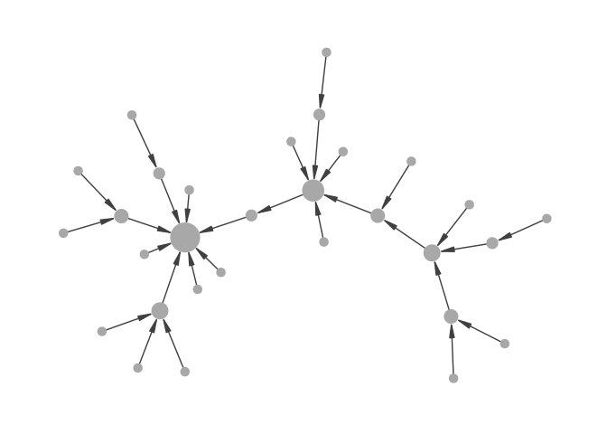

I would not be surprised though if there is an even easier fix for this
problem.

> “How can I lower the opacity of nodes without making edges visible
> underneath?”

One of the rules I try to follow is that edges should not be visible on
top of nodes. Usually that is easy to achieve by drawing the edges
before the nodes. But if you want to lower the opacity of nodes, they do
become visible again.

``` r
g <- sample_gnp(20, 0.5)
V(g)$degree <- degree(g)

ggraph(g, "stress") +
  geom_edge_link(edge_colour = "grey66") +
  geom_node_point(
    size = 8,
    aes(alpha = degree),
    col = "red",
    show.legend = FALSE
  ) +
  theme_graph()
```

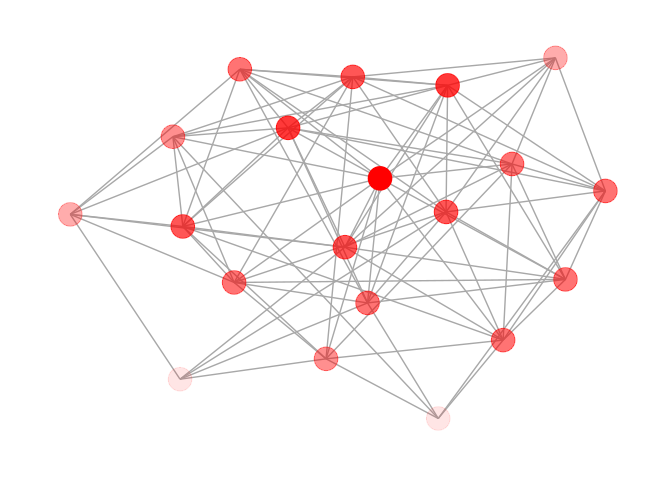

The solution is rather simple. Just add a node layer with the same
aesthetics below with `alpha=1` (default) and `color="white"` (or the
background color of the plot).

``` r
ggraph(g, "stress") +
  geom_edge_link(edge_colour = "grey66") +
  geom_node_point(size = 8, col = "white") +
  geom_node_point(
    aes(alpha = degree),
    size = 8,
    col = "red",
    show.legend = FALSE
  ) +
  theme_graph()
```


Of course you could also use `start_cap` and `end_cap` here, but you may
have to fiddle again as in the last example.

> “How can I enhance readability of node labels in hairball graphs?”

Sometimes it is really hard to make labels readable when the network is
very cluttered

``` r
g <- sample_gnp(50, 0.7)
V(g)$name <- sapply(1:50, function(x) paste0(sample(LETTERS, 4), collapse = ""))
E(g)$weight <- runif(ecount(g))

ggraph(g) +
  geom_edge_link0(aes(edge_color = weight, edge_width = weight), show.legend = FALSE) +
  geom_node_point(size = 8, color = "#44a6c6") +
  geom_node_text(aes(label = name), fontface = "bold") +
  scale_edge_color_continuous(low = "grey66", high = "black") +
  scale_edge_width(range = c(0.1, 0.5)) +
  theme_graph() +
  coord_fixed()
```

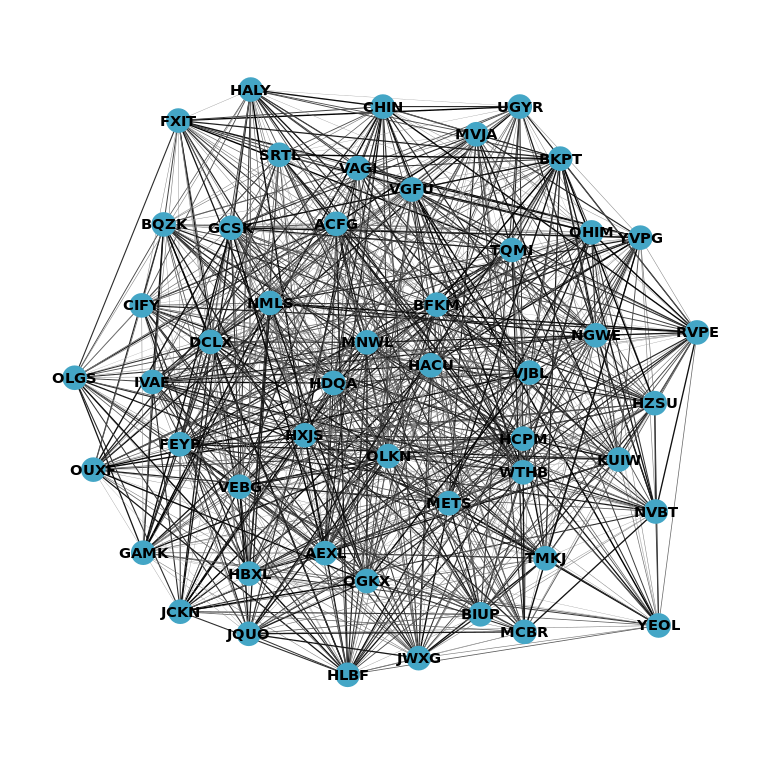

Here you can make use of the fact that the layout of the nodes are
stored in a “hidden” data frame when a `ggraph` object is constructed.
That means you can use other geoms from other packages. In this case,
the `shadowtext` package as shown below.

``` r
ggraph(g,"stress") +
  geom_edge_link0(aes(edge_color = weight, edge_width = weight), show.legend = FALSE) +
  geom_node_point(size = 8, color = "#44a6c6") +
  shadowtext::geom_shadowtext(aes(x, y, label = name), color = "black", size = 4, bg.colour = "white") +
  scale_edge_color_continuous(low = "grey66", high = "black") +
  scale_edge_width(range = c(0.1, 0.5)) +
  theme_graph() +
  coord_fixed()
```

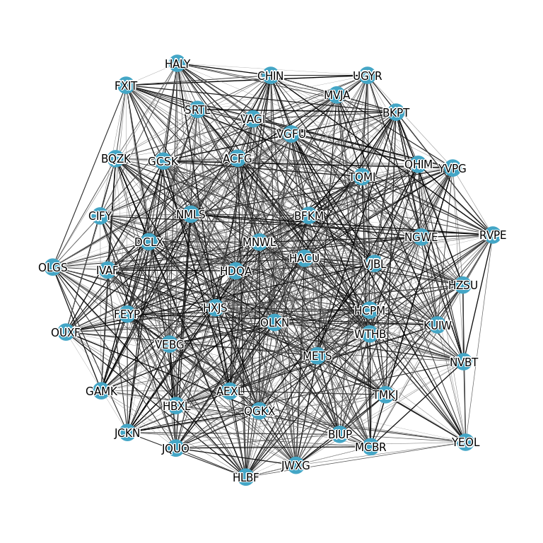

# snahelper

Even with a lot of experience, it may still be a painful process to
produce nice looking figures by writing `ggraph` code. Enter the
`snahelper`.

``` r
install.packages("snahelper")
```

The `snahelper` is an RStudio addin which provides you with a GUI to
plot networks. Instead of writing code, you simply use drop-down menus
to assign attributes to aesthetics or change appearances globally. One
great feature of the addin is that you can adjust the position of nodes
individually if you are not satisfied with their location. Once you are
done, you can either directly export the figure to png or automatically
insert the code to produce the figure into your script. That way, you
can review the code and hopefully learn something from it. Below if a
demo that shows its functionality.


To use the addin, simply highlight the variable name of your network
within an R script and choose the SNAhelper from the Addins drop-down
menu within RStudio. You can find more about the Addin on its dedicated
[pkgdown page](http://snahelper.schochastics.net)

# Advanced layouts

While “stress” is the key layout algorithm in `graphlayouts`, there are
other, more specialized layouts that can be used for different purposes.
In this part, we work through some examples with concentric layouts and
learn how to disentangle extreme “hairball” networks.

## Concentric layouts

Circular layouts are generally not advisable. Concentric circles, on the
other hand, help to emphasize the position of certain nodes in the
network. The `graphlayouts` package has two function to create
concentric layouts, `layout_with_focus()` and
`layout_with_centrality()`.

The first one allows to focus the network on a specific node and arrange
all other nodes in concentric circles (depending on the geodesic
distance) around it. Below we focus on the character *Ned Stark*.

``` r
ggraph(gotS1, layout = "focus", focus = 1) +
  geom_edge_link0(aes(edge_width = weight), edge_colour = "grey66") +
  geom_node_point(aes(fill = clu, size = size), shape = 21) +
  geom_node_text(aes(filter = (name == "Ned"), size = size, label = name),
    family = "serif"
  ) +
  scale_edge_width_continuous(range = c(0.2, 1.2)) +
  scale_size_continuous(range = c(1, 5)) +
  scale_fill_manual(values = got_palette) +
  coord_fixed() +
  theme_graph() +
  theme(legend.position = "none")
```

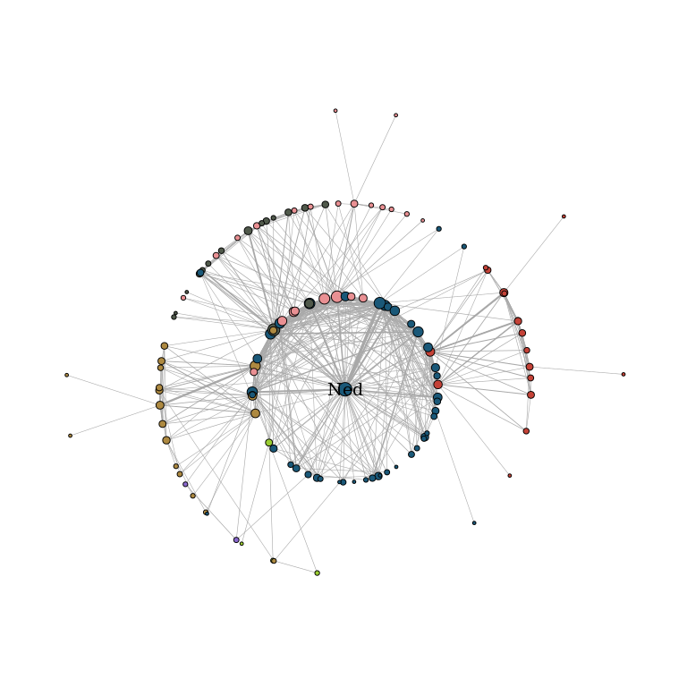

The parameter `focus` in the first line is used to choose the node id of
the focal node. The function `coord_fixed()` is used to always keep the
aspect ratio at one (i.e. the circles are always displayed as a circle
and not an ellipse).

The function `draw_circle()` can be used to add the circles explicitly.

``` r
ggraph(gotS1, layout = "focus", focus = 1) +
  draw_circle(col = "#00BFFF", use = "focus", max.circle = 3) +
  geom_edge_link0(aes(width = weight), edge_colour = "grey66") +
  geom_node_point(aes(fill = clu, size = size), shape = 21) +
  geom_node_text(aes(filter = (name == "Ned"), size = size, label = name),
    family = "serif"
  ) +
  scale_edge_width_continuous(range = c(0.2, 1.2)) +
  scale_size_continuous(range = c(1, 5)) +
  scale_fill_manual(values = got_palette) +
  coord_fixed() +
  theme_graph() +
  theme(legend.position = "none")
```

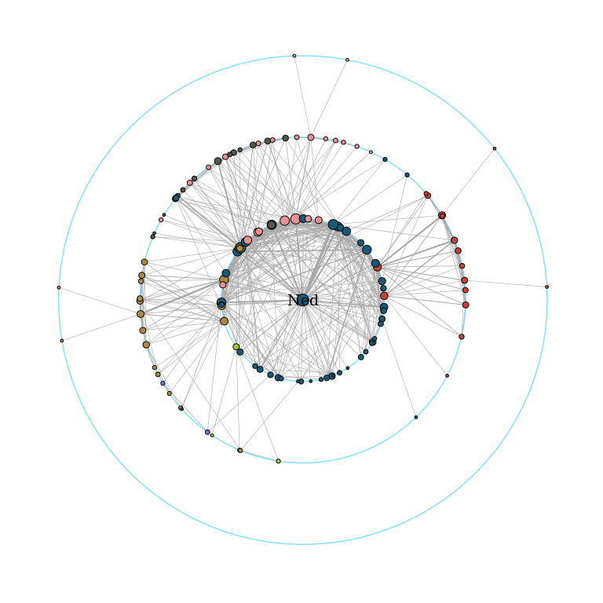

`layout_with_centrality()` works in a similar way. You can specify any
centrality index (or any numeric vector for that matter), and create a
concentric layout where the most central nodes are put in the center and
the most peripheral nodes in the biggest circle. The numeric attribute
used for the layout is specified with the `cent` parameter. Here, we use
the weighted degree of the characters.

``` r
ggraph(gotS1, layout = "centrality", cent = graph.strength(gotS1)) +
  geom_edge_link0(aes(edge_width = weight), edge_colour = "grey66") +
  geom_node_point(aes(fill = clu, size = size), shape = 21) +
  geom_node_text(aes(size = size, label = name), family = "serif") +
  scale_edge_width_continuous(range = c(0.2, 0.9)) +
  scale_size_continuous(range = c(1, 8)) +
  scale_fill_manual(values = got_palette) +
  coord_fixed() +
  theme_graph() +
  theme(legend.position = "none")
```

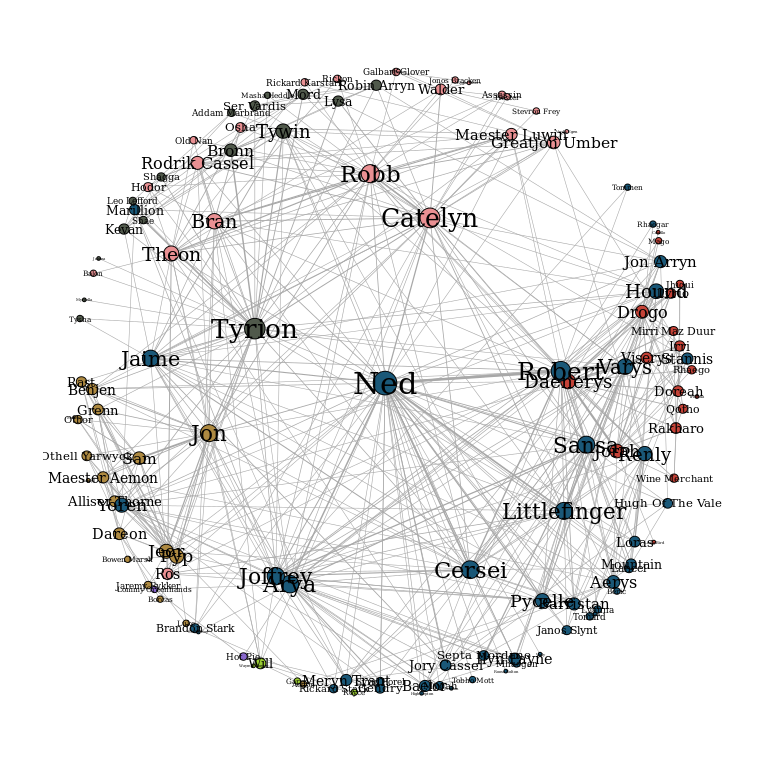

(*Concentric layouts are not only helpful to focus on specific nodes,
but also make for a good tool to visualize ego networks.*)

## Backbone layout

`layout_as_backbone()` is a layout algorithm that can help emphasize
hidden group structures. To illustrate the performance of the algorithm,
we create an artificial network with a subtle group structure using
`sample_islands()` from `igraph`.

``` r
g <- sample_islands(9, 40, 0.4, 15)
g <- simplify(g)
V(g)$grp <- as.character(rep(1:9, each = 40))
```

The network consists of 9 groups with 40 vertices each. The density
within each group is 0.4 and there are 15 edges running between each
pair of groups. Let us try to visualize the network with what we have
learned so far.

``` r
ggraph(g, layout = "stress") +
  geom_edge_link0(edge_colour = "black", edge_width = 0.1, edge_alpha = 0.5) +
  geom_node_point(aes(fill = grp), shape = 21) +
  scale_fill_brewer(palette = "Set1") +
  theme_graph() +
  theme(legend.position = "none")
```

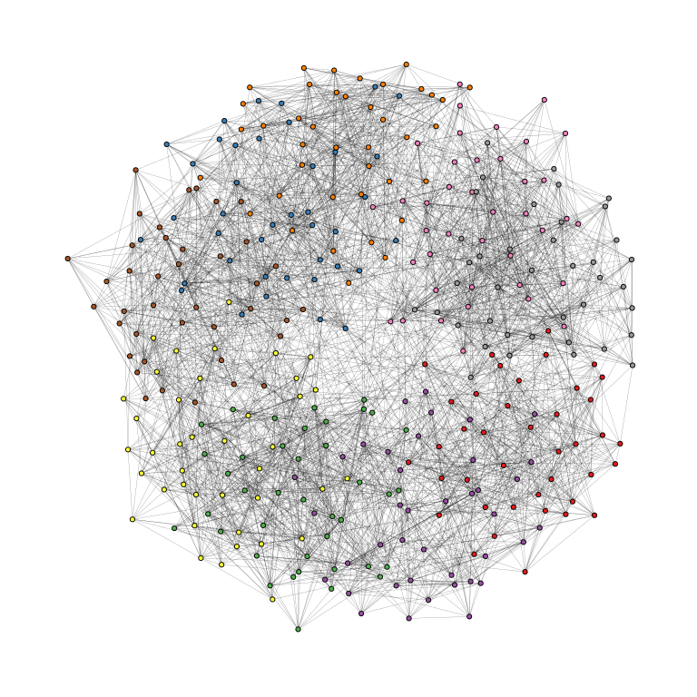

As you can see, the graph seems to be a proper “hairball” without any
special structural features standing out. In this case, though, we know
that there should be 9 groups of vertices that are internally more
densely connected than externally. To uncover this group structure, we
turn to the “backbone layout”.

``` r
bb <- layout_as_backbone(g, keep = 0.4)
E(g)$col <- FALSE
E(g)$col[bb$backbone] <- TRUE
```

The idea of the algorithm is as follows. For each edge, an embededness
score is calculated which serves as an edge weight attribute. These
weights are then ordered and only the edges with the highest score are
kept. The number of edges to keep is controlled with the `keep`
parameter. In our example, we keep the top 40%. The parameter usually
requires some experimenting to find out what works best. Since this may
result in an unconnected network, we add all edges of the union of all
[maximum spanning trees](https://en.wikipedia.org/wiki/Spanning_tree).
The resulting network is the “backbone” of the original network and the
“stress” layout algorithm is applied to this network. Once the layout is
calculated, all edges are added back to the network.

The output of the function are the x and y coordinates for nodes and a
vector that gives the ids of the edges in the backbone network. In the
code above, we use this vector to create a binary edge attribute that
indicates if an edge is part of the backbone or not.

To use the coordinates, we set the `layout` parameter to “manual” and
provide the x and y coordinates as parameters.

``` r
ggraph(g, layout = "manual", x = bb$xy[, 1], y = bb$xy[, 2]) +
  geom_edge_link0(aes(edge_colour = col), edge_width = 0.1) +
  geom_node_point(aes(fill = grp), shape = 21) +
  scale_fill_brewer(palette = "Set1") +
  scale_edge_color_manual(values = c(rgb(0, 0, 0, 0.3), rgb(0, 0, 0, 1))) +
  theme_graph() +
  theme(legend.position = "none")
```

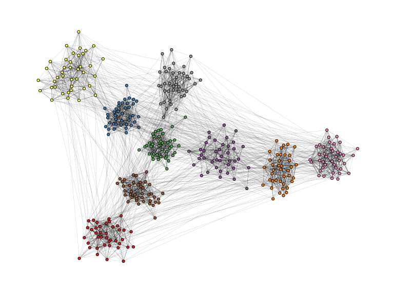

The groups are now clearly visible! Of course the network used in the
example is specifically tailored to illustrate the power of the
algorithm. Using the backbone layout in real world networks may not
always result in such a clear division of groups. It should thus not be
seen as a universal remedy for drawing hairball networks. Keep in mind:
It can **only** emphasize a hidden group structure **if it exists**.

The plot below shows an empirical example where the algorithm was able
to uncover a hidden group structure. The network shows facebook
friendships of a university in the US. Node colour corresponds to
dormitory of students. Left is the ordinary stress layout and right the
backbone layout.


## Dynamic networks

People regularly ask me if it is possible to animate a network evolution
with `ggraph` and `gganimate`. Unfortunately this is not yet possible.
But fear not! There is a way to still get it done with some hacking
around the ggraph package. I will walk through this hack below but hope
that it will eventually become obsolete.

For this part of the tutorial, you will need two additional packages.

``` r
library(gganimate)
library(ggplot2)
library(patchwork)
```

We will be using the *50 actor excerpt from the Teenage Friends and
Lifestyle Study* from the [RSiena data
repository](https://www.stats.ox.ac.uk/~snijders/siena/siena_datasets.htm)
as an example. The data is part of the `networkdata` package.

``` r
data("s50")
```

The dataset consists of three networks with 50 actors each and a vertex
attribute for the smoking behaviour of students. As a first step, we
need to create a layout for all three networks. You can basically use
any type of layout for each network, but I’d recommend
`layout_as_dynamic()` from my very own package {{graphlayouts}}. The
algorithm calculates a reference layout which is a layout of the union
of all networks and individual layouts based on stress minimization and
combines those in a linear combination which is controlled by the
`alpha` parameter. For `alpha=1`, only the reference layout is used and
all graphs have the same layout. For `alpha=0`, the stress layout of
each individual graph is used. Values in-between interpolate between the
two layouts.

``` r
xy <- layout_as_dynamic(s50, alpha = 0.2)
```

Now you could use {{ggraph}} and {{patchwork}} to produce a static plot
with all networks side-by-side.

``` r
pList <- vector("list", length(s50))

for (i in 1:length(s50)) {
  pList[[i]] <- ggraph(s50[[i]], layout = "manual", x = xy[[i]][, 1], y = xy[[i]][, 2]) +
    geom_edge_link0(edge_width = 0.6, edge_colour = "grey66") +
    geom_node_point(shape = 21, aes(fill = as.factor(smoke)), size = 6) +
    geom_node_text(label = 1:50, repel = FALSE, color = "white", size = 4) +
    scale_fill_manual(
      values = c("forestgreen", "grey25", "firebrick"),
      guide = ifelse(i != 2, "none", "legend"),
      name = "smoking",
      labels = c("never", "occasionally", "regularly")
    ) +
    theme_graph() +
    theme(legend.position = "bottom",plot.title = element_text(family = "serif"),
    legend.text = element_text(family = "serif"),
    legend.title = element_text(family = "serif")) +
    labs(title = paste0("Wave ", i))
}

wrap_plots(pList)
```

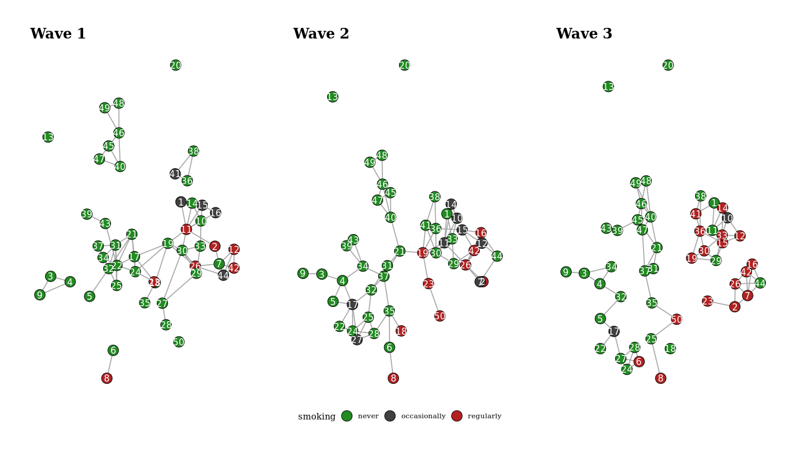

This is nice but of course we want to animate the changes. This is where
we say goodbye to `ggraph` and hello to good-old `ggplot2`. First, we
create a list of data frames for all nodes and add the layout to it.

``` r
nodes_lst <- lapply(1:length(s50), function(i) {
  cbind(igraph::as_data_frame(s50[[i]], "vertices"),
    x = xy[[i]][, 1], y = xy[[i]][, 2], frame = i
  )
})
```

This was the easy part, because all nodes are present in all time frames
so there is not much to do. Edges will be a lot trickier.

``` r
edges_lst <- lapply(1:length(s50), function(i) {
  cbind(igraph::as_data_frame(s50[[i]], "edges"), frame = i)
})

edges_lst <- lapply(1:length(s50), function(i) {
  edges_lst[[i]]$x <- nodes_lst[[i]]$x[match(edges_lst[[i]]$from, nodes_lst[[i]]$name)]
  edges_lst[[i]]$y <- nodes_lst[[i]]$y[match(edges_lst[[i]]$from, nodes_lst[[i]]$name)]
  edges_lst[[i]]$xend <- nodes_lst[[i]]$x[match(edges_lst[[i]]$to, nodes_lst[[i]]$name)]
  edges_lst[[i]]$yend <- nodes_lst[[i]]$y[match(edges_lst[[i]]$to, nodes_lst[[i]]$name)]
  edges_lst[[i]]$id <- paste0(edges_lst[[i]]$from, "-", edges_lst[[i]]$to)
  edges_lst[[i]]$status <- TRUE
  edges_lst[[i]]
})

head(edges_lst[[1]])
```

      from  to frame         x          y      xend       yend     id status
    1   V1 V11     1  1.898908  0.3949699  2.183083 -0.6074410 V1-V11   TRUE
    2   V1 V14     1  1.898908  0.3949699  2.482477  0.3494923 V1-V14   TRUE
    3   V2  V7     1  3.666859 -1.2214708  3.890805 -1.8636931  V2-V7   TRUE
    4   V2 V11     1  3.666859 -1.2214708  2.183083 -0.6074410 V2-V11   TRUE
    5   V3  V4     1 -4.885045 -2.3203080 -3.869352 -2.5164775  V3-V4   TRUE
    6   V3  V9     1 -4.885045 -2.3203080 -5.448692 -2.9920365  V3-V9   TRUE

We have expanded the edge data frame in a way that also includes the
coordinates of the endpoints from the layout that we calculated earlier.

Now we create a helper matrix which includes all edges that are present
in any of the networks

``` r
all_edges <- do.call("rbind", lapply(s50, get.edgelist))
all_edges <- all_edges[!duplicated(all_edges), ]
all_edges <- cbind(all_edges, paste0(all_edges[, 1], "-", all_edges[, 2]))
```

This is used to impute the edges into all networks. So any edge that is
not present in time frame two and three gets added to time frame one.
But to keep track of these, we set there status to `FALSE`.

``` r
edges_lst <- lapply(1:length(s50), function(i) {
  idx <- which(!all_edges[, 3] %in% edges_lst[[i]]$id)
  if (length(idx != 0)) {
    tmp <- data.frame(from = all_edges[idx, 1], to = all_edges[idx, 2], id = all_edges[idx, 3])
    tmp$x <- nodes_lst[[i]]$x[match(tmp$from, nodes_lst[[i]]$name)]
    tmp$y <- nodes_lst[[i]]$y[match(tmp$from, nodes_lst[[i]]$name)]
    tmp$xend <- nodes_lst[[i]]$x[match(tmp$to, nodes_lst[[i]]$name)]
    tmp$yend <- nodes_lst[[i]]$y[match(tmp$to, nodes_lst[[i]]$name)]
    tmp$frame <- i
    tmp$status <- FALSE
    edges_lst[[i]] <- rbind(edges_lst[[i]], tmp)
  }
  edges_lst[[i]]
})
```

Why are we doing this? After a lot of experimenting, I came to the
conclusion that it is always best to draw all edges, but use zero
opacity if `status = FALSE`. In that way, one gets a smoother transition
for edges that (dis)appear. There are probably other workarounds though.

In the last step, we create a data frame out of the lists.

``` r
edges_df <- do.call("rbind", edges_lst)
nodes_df <- do.call("rbind", nodes_lst)

head(edges_df)
```

      from  to frame         x          y      xend       yend     id status
    1   V1 V11     1  1.898908  0.3949699  2.183083 -0.6074410 V1-V11   TRUE
    2   V1 V14     1  1.898908  0.3949699  2.482477  0.3494923 V1-V14   TRUE
    3   V2  V7     1  3.666859 -1.2214708  3.890805 -1.8636931  V2-V7   TRUE
    4   V2 V11     1  3.666859 -1.2214708  2.183083 -0.6074410 V2-V11   TRUE
    5   V3  V4     1 -4.885045 -2.3203080 -3.869352 -2.5164775  V3-V4   TRUE
    6   V3  V9     1 -4.885045 -2.3203080 -5.448692 -2.9920365  V3-V9   TRUE

``` r
head(nodes_df)
```

       name smoke         x          y frame
    V1   V1     2  1.898908  0.3949699     1
    V2   V2     3  3.666859 -1.2214708     1
    V3   V3     1 -4.885045 -2.3203080     1
    V4   V4     1 -3.869352 -2.5164775     1
    V5   V5     1 -2.856623 -3.0483392     1
    V6   V6     1 -1.629105 -5.0175038     1

And that’s it in terms of data wrangling. All that is left is to
plot/animate the data.

``` r
ggplot() +
  geom_segment(
    data = edges_df,
    aes(x = x, xend = xend, y = y, yend = yend, group = id, alpha = status),
    show.legend = FALSE
  ) +
  geom_point(
    data = nodes_df, aes(x, y, group = name, fill = as.factor(smoke)),
    shape = 21, size = 4, show.legend = FALSE
  ) +
  scale_fill_manual(values = c("forestgreen", "grey25", "firebrick")) +
  scale_alpha_manual(values = c(0, 1)) +
  ease_aes("quadratic-in-out") +
  transition_states(frame, state_length = 0.5, wrap = FALSE) +
  labs(title = "Wave {closest_state}") +
  theme_void()
```


## Multilevel networks

In this section, you will get to know `layout_as_multilevel()`, a layout
algorithm in the `raphlayouts` package which can be use to visualize
multilevel networks.

A multilevel network consists of two (or more) levels with different
node sets and intra-level ties. For instance, one level could be
scientists and their collaborative ties and the second level are labs
and ties among them, and inter-level edges are the affiliations of
scientists and labs.

The `graphlayouts` package contains an artificial multilevel network
which will be used to illustrate the algorithm.

``` r
data("multilvl_ex")
```

The package assumes that a multilevel network has a vertex attribute
called `lvl` which holds the level information (1 or 2).

The underlying algorithm of `layout_as_multilevel()` has three different
versions, which can be used to emphasize different structural features
of a multilevel network.

Independent of which option is chosen, the algorithm internally produces
a 3D layout, where each level is positioned on a different y-plane. The
3D layout is then mapped to 2D with an [isometric
projection](https://en.wikipedia.org/wiki/Isometric_projection). The
parameters `alpha` and `beta` control the perspective of the projection.
The default values seem to work for many instances, but may not always
be optimal. As a rough guideline: `beta` rotates the plot around the y
axis (in 3D) and `alpha` moves the POV up or down.

### Complete layout

A layout for the complete network can be computed via
`layout_as_multilevel()` setting `type = "all"`. Internally, the
algorithm produces a constrained 3D stress layout (each level on a
different y plane) which is then projected to 2D. This layout ignores
potential differences in each level and optimizes only the overall
layout.

``` r
xy <- layout_as_multilevel(multilvl_ex, type = "all", alpha = 25, beta = 45)
```

To visualize the network with `ggraph`, you may want to draw the edges
for each level (and inter level edges) with a different edge geom. This
gives you more flexibility to control aesthetics and can easily be
achieved with a filter.

``` r
ggraph(multilvl_ex, "manual", x = xy[, 1], y = xy[, 2]) +
  geom_edge_link0(
    aes(filter = (node1.lvl == 1 & node2.lvl == 1)),
    edge_colour = "firebrick3",
    alpha = 0.5,
    edge_width = 0.3
  ) +
  geom_edge_link0(
    aes(filter = (node1.lvl != node2.lvl)),
    alpha = 0.3,
    edge_width = 0.1,
    edge_colour = "black"
  ) +
  geom_edge_link0(
    aes(filter = (node1.lvl == 2 &
      node2.lvl == 2)),
    edge_colour = "goldenrod3",
    edge_width = 0.3,
    alpha = 0.5
  ) +
  geom_node_point(aes(shape = as.factor(lvl)), fill = "grey25", size = 3) +
  scale_shape_manual(values = c(21, 22)) +
  theme_graph() +
  coord_cartesian(clip = "off", expand = TRUE) +
  theme(legend.position = "none")
```

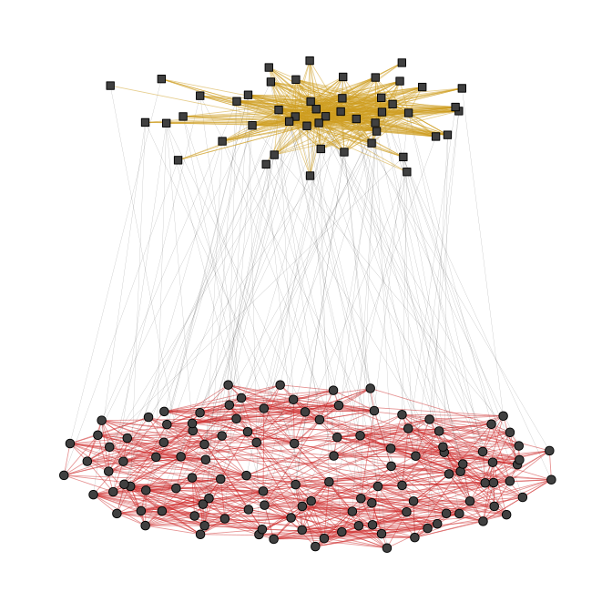

### Separate layouts for both levels

In many instances, there may be different structural properties inherent
to the levels of the network. In that case, two layout functions can be
passed to `layout_as_multilevel()` to deal with these differences. In
our artificial network, level 1 has a hidden group structure and level 2
has a core-periphery structure.

To use this layout option, set `type = "separate"` and specify two
layout functions with `FUN1` and `FUN2`. You can change internal
parameters of these layout functions with named lists in the `params1`
and `params2` argument. Note that this version optimizes inter-level
edges only minimally. The emphasis is on the intra-level structures.

``` r
xy <- layout_as_multilevel(multilvl_ex,
  type = "separate",
  FUN1 = layout_as_backbone,
  FUN2 = layout_with_stress,
  alpha = 25, beta = 45
)
```

Again, try to include an edge geom for each level.

``` r
cols2 <- c(
  "#3A5FCD", "#CD00CD", "#EE30A7", "#EE6363",
  "#CD2626", "#458B00", "#EEB422", "#EE7600"
)

ggraph(multilvl_ex, "manual", x = xy[, 1], y = xy[, 2]) +
  geom_edge_link0(aes(
    filter = (node1.lvl == 1 & node2.lvl == 1),
    edge_colour = col
  ),
  alpha = 0.5, edge_width = 0.3
  ) +
  geom_edge_link0(
    aes(filter = (node1.lvl != node2.lvl)),
    alpha = 0.3,
    edge_width = 0.1,
    edge_colour = "black"
  ) +
  geom_edge_link0(aes(
    filter = (node1.lvl == 2 & node2.lvl == 2),
    edge_colour = col
  ),
  edge_width = 0.3, alpha = 0.5
  ) +
  geom_node_point(aes(
    fill = as.factor(grp),
    shape = as.factor(lvl),
    size = nsize
  )) +
  scale_shape_manual(values = c(21, 22)) +
  scale_size_continuous(range = c(1.5, 4.5)) +
  scale_fill_manual(values = cols2) +
  scale_edge_color_manual(values = cols2, na.value = "grey12") +
  scale_edge_alpha_manual(values = c(0.1, 0.7)) +
  theme_graph() +
  coord_cartesian(clip = "off", expand = TRUE) +
  theme(legend.position = "none")
```

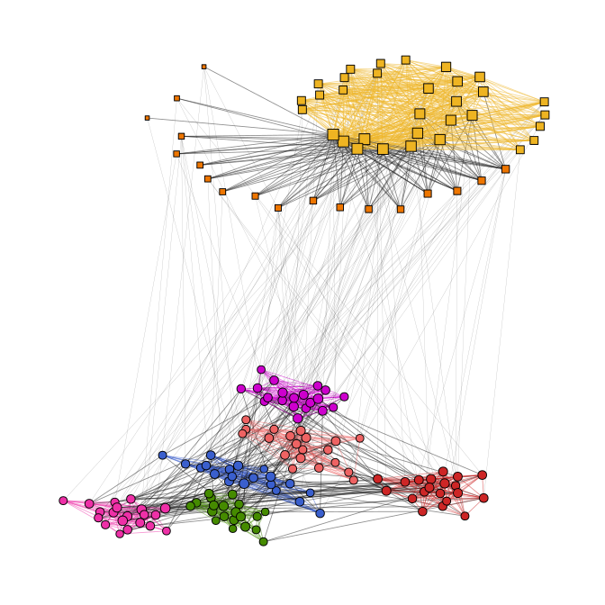

### Fix only one level

This layout can be used to emphasize one intra-level structure. The
layout of the second level is calculated in a way that optimizes
inter-level edge placement. Set `type = "fix1"` and specify `FUN1` and
possibly `params1` to fix level 1 or set `type = "fix2"` and specify
`FUN2` and possibly `params2` to fix level 2.

``` r
xy <- layout_as_multilevel(multilvl_ex,
  type = "fix2",
  FUN2 = layout_with_stress,
  alpha = 25, beta = 45
)

ggraph(multilvl_ex, "manual", x = xy[, 1], y = xy[, 2]) +
  geom_edge_link0(aes(
    filter = (node1.lvl == 1 & node2.lvl == 1),
    edge_colour = col
  ),
  alpha = 0.5, edge_width = 0.3
  ) +
  geom_edge_link0(
    aes(filter = (node1.lvl != node2.lvl)),
    alpha = 0.3,
    edge_width = 0.1,
    edge_colour = "black"
  ) +
  geom_edge_link0(aes(
    filter = (node1.lvl == 2 & node2.lvl == 2),
    edge_colour = col
  ),
  edge_width = 0.3, alpha = 0.5
  ) +
  geom_node_point(aes(
    fill = as.factor(grp),
    shape = as.factor(lvl),
    size = nsize
  )) +
  scale_shape_manual(values = c(21, 22)) +
  scale_size_continuous(range = c(1.5, 4.5)) +
  scale_fill_manual(values = cols2) +
  scale_edge_color_manual(values = cols2, na.value = "grey12") +
  scale_edge_alpha_manual(values = c(0.1, 0.7)) +
  theme_graph() +
  coord_cartesian(clip = "off", expand = TRUE) +
  theme(legend.position = "none")
```

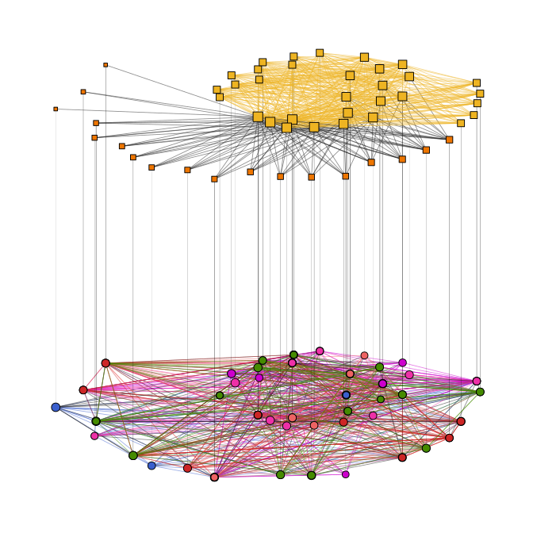

### 3D with threejs

Instead of the default 2D projection, `layout_as_multilevel()` can also
return the 3D layout by setting `project2d = FALSE`. The 3D layout can
then be used with e.g. `threejs` to produce an interactive 3D
visualization.

``` r
library(threejs)
xyz <- layout_as_multilevel(multilvl_ex,
  type = "separate",
  FUN1 = layout_as_backbone,
  FUN2 = layout_with_stress,
  project2D = FALSE
)
multilvl_ex$layout <- xyz
V(multilvl_ex)$color <- c("#00BFFF", "#FF69B4")[V(multilvl_ex)$lvl]
V(multilvl_ex)$vertex.label <- V(multilvl_ex)$name

graphjs(multilvl_ex, bg = "black", vertex.shape = "sphere")
```

<div class="scatterplotThree html-widget html-fill-item-overflow-hidden html-fill-item" id="ZFNFlrzXe2" style="width:100%;height:672px;"></div>
<script type="application/json" data-for="ZFNFlrzXe2">{"x":{"NROW":170,"height":null,"width":null,"axis":false,"numticks":[6,6,6],"xticklabs":null,"yticklabs":null,"zticklabs":null,"color":[["#00BFFF","#00BFFF","#00BFFF","#00BFFF","#00BFFF","#00BFFF","#00BFFF","#00BFFF","#00BFFF","#00BFFF","#00BFFF","#00BFFF","#00BFFF","#00BFFF","#00BFFF","#00BFFF","#00BFFF","#00BFFF","#00BFFF","#00BFFF","#00BFFF","#00BFFF","#00BFFF","#00BFFF","#00BFFF","#00BFFF","#00BFFF","#00BFFF","#00BFFF","#00BFFF","#00BFFF","#00BFFF","#00BFFF","#00BFFF","#00BFFF","#00BFFF","#00BFFF","#00BFFF","#00BFFF","#00BFFF","#00BFFF","#00BFFF","#00BFFF","#00BFFF","#00BFFF","#00BFFF","#00BFFF","#00BFFF","#00BFFF","#00BFFF","#00BFFF","#00BFFF","#00BFFF","#00BFFF","#00BFFF","#00BFFF","#00BFFF","#00BFFF","#00BFFF","#00BFFF","#00BFFF","#00BFFF","#00BFFF","#00BFFF","#00BFFF","#00BFFF","#00BFFF","#00BFFF","#00BFFF","#00BFFF","#00BFFF","#00BFFF","#00BFFF","#00BFFF","#00BFFF","#00BFFF","#00BFFF","#00BFFF","#00BFFF","#00BFFF","#00BFFF","#00BFFF","#00BFFF","#00BFFF","#00BFFF","#00BFFF","#00BFFF","#00BFFF","#00BFFF","#00BFFF","#00BFFF","#00BFFF","#00BFFF","#00BFFF","#00BFFF","#00BFFF","#00BFFF","#00BFFF","#00BFFF","#00BFFF","#00BFFF","#00BFFF","#00BFFF","#00BFFF","#00BFFF","#00BFFF","#00BFFF","#00BFFF","#00BFFF","#00BFFF","#00BFFF","#00BFFF","#00BFFF","#FF69B4","#FF69B4","#FF69B4","#FF69B4","#FF69B4","#FF69B4","#FF69B4","#FF69B4","#FF69B4","#FF69B4","#FF69B4","#FF69B4","#FF69B4","#FF69B4","#FF69B4","#FF69B4","#FF69B4","#FF69B4","#FF69B4","#FF69B4","#FF69B4","#FF69B4","#FF69B4","#FF69B4","#FF69B4","#FF69B4","#FF69B4","#FF69B4","#FF69B4","#FF69B4","#FF69B4","#FF69B4","#FF69B4","#FF69B4","#FF69B4","#FF69B4","#FF69B4","#FF69B4","#FF69B4","#FF69B4","#FF69B4","#FF69B4","#FF69B4","#FF69B4","#FF69B4","#FF69B4","#FF69B4","#FF69B4","#FF69B4","#00BFFF","#00BFFF","#00BFFF","#00BFFF","#00BFFF","#00BFFF","#00BFFF","#FF69B4"]],"size":2,"stroke":"black","flipy":true,"grid":false,"renderer":"auto","signif":8,"bg":"black","cexsymbols":1,"xlim":[-1,1],"ylim":[-1,1],"zlim":[-1,1],"axisscale":[1,1,1],"pch":["o","o","o","o","o","o","o","o","o","o","o","o","o","o","o","o","o","o","o","o","o","o","o","o","o","o","o","o","o","o","o","o","o","o","o","o","o","o","o","o","o","o","o","o","o","o","o","o","o","o","o","o","o","o","o","o","o","o","o","o","o","o","o","o","o","o","o","o","o","o","o","o","o","o","o","o","o","o","o","o","o","o","o","o","o","o","o","o","o","o","o","o","o","o","o","o","o","o","o","o","o","o","o","o","o","o","o","o","o","o","o","o","o","o","o","o","o","o","o","o","o","o","o","o","o","o","o","o","o","o","o","o","o","o","o","o","o","o","o","o","o","o","o","o","o","o","o","o","o","o","o","o","o","o","o","o","o","o","o","o","o","o","o","o","o","o","o","o","o","o"],"elementId":"ZFNFlrzXe2","from":[[0,0,0,0,0,0,0,0,0,0,1,1,1,1,1,1,1,1,1,1,1,1,1,1,2,2,2,2,2,2,2,2,3,3,3,3,3,3,3,3,3,3,3,4,4,4,4,4,4,4,4,4,4,5,5,5,5,5,5,5,5,5,5,5,5,6,6,6,6,6,6,6,6,6,7,7,7,7,7,7,7,7,7,8,8,8,8,8,8,8,8,8,9,9,9,10,10,10,10,10,10,10,11,11,11,11,11,11,11,11,11,11,11,11,11,11,11,12,12,12,12,12,12,12,12,13,13,13,13,13,14,14,14,14,14,14,14,14,14,14,14,14,15,15,15,15,15,15,16,16,16,16,16,17,17,17,18,18,19,19,19,19,19,19,19,19,19,19,19,19,19,20,20,20,20,20,20,20,20,20,20,20,20,20,21,21,21,21,21,21,21,21,21,21,21,21,21,22,22,22,22,22,22,22,22,22,23,23,23,23,23,23,23,23,23,23,23,23,23,24,24,24,24,24,24,24,24,24,24,24,25,25,25,25,25,25,26,26,26,26,26,26,26,26,26,26,27,27,27,27,27,27,27,28,28,28,28,28,28,28,28,28,28,29,29,29,29,29,29,30,30,30,30,30,30,30,31,31,31,31,31,31,31,32,32,32,32,32,33,33,33,33,33,33,33,34,34,34,34,34,35,35,35,35,35,35,35,35,36,36,36,37,37,37,38,38,38,38,38,38,38,38,38,38,38,38,38,38,39,39,39,39,39,39,39,39,39,39,40,40,40,40,40,40,40,40,40,40,41,41,41,41,41,41,41,41,41,41,41,42,42,42,42,42,42,42,42,42,42,42,42,42,42,42,42,42,43,43,43,43,43,43,43,43,43,43,43,44,44,44,44,44,44,44,44,44,44,44,44,45,45,45,45,45,45,45,46,46,46,46,46,46,46,47,47,47,47,48,48,48,48,48,48,48,49,49,49,49,49,49,50,50,50,50,50,50,51,51,51,51,51,51,51,51,52,52,52,53,53,53,53,54,54,54,55,55,55,55,56,56,56,56,56,56,56,56,56,56,56,56,56,57,57,57,57,57,57,57,57,57,57,57,58,58,58,58,58,58,58,59,59,59,59,59,59,59,59,59,60,60,60,60,60,60,60,60,60,60,61,61,61,61,61,61,61,62,62,62,62,62,62,62,62,62,62,62,62,63,63,63,63,63,63,63,63,64,64,64,64,64,65,65,65,65,65,65,66,66,66,66,66,66,66,67,67,68,68,68,68,69,69,69,69,70,70,70,70,70,71,71,71,71,72,72,72,73,74,74,75,75,75,75,75,75,75,75,76,76,76,76,76,76,76,76,76,77,77,77,77,77,77,77,77,77,77,77,77,77,77,77,77,78,78,78,78,78,78,78,78,79,79,79,79,79,79,79,79,79,79,79,80,80,80,80,80,80,80,80,80,81,81,81,81,81,81,81,82,82,82,82,82,82,83,83,83,83,83,83,83,84,84,84,84,84,84,84,85,85,85,85,85,85,86,86,86,86,86,86,86,87,87,87,87,87,87,87,88,88,88,88,88,88,89,89,89,89,90,90,90,91,91,91,91,92,93,94,94,94,94,94,94,94,94,95,95,95,95,95,95,95,95,95,95,95,95,96,96,96,96,96,96,96,96,96,96,97,97,97,97,97,97,97,97,97,97,97,98,98,98,98,98,98,98,98,99,99,99,99,99,99,100,100,100,100,100,100,100,100,100,100,100,100,101,101,101,101,101,101,101,102,102,102,102,102,103,103,103,103,103,103,103,104,104,104,104,105,105,105,106,106,106,106,106,106,107,107,108,108,108,108,108,109,109,110,111,112,113,114,115,116,117,118,119,120,121,122,123,124,113,114,115,116,117,118,119,120,121,122,123,124,125,126,127,128,113,114,115,116,117,118,119,120,121,122,123,124,125,126,127,128,129,113,114,115,116,117,118,119,120,121,122,123,124,125,126,127,128,129,130,113,114,115,116,117,118,119,120,121,122,123,124,125,126,127,128,129,130,131,132,113,114,115,116,117,118,119,120,121,122,123,124,125,126,127,128,129,130,131,132,133,134,113,114,115,116,117,118,119,120,121,122,123,124,125,126,127,128,129,130,131,132,133,134,135,136,137,113,114,115,116,117,118,119,120,121,122,123,124,125,126,127,128,129,130,131,132,133,134,135,136,137,138,113,114,115,116,117,118,119,120,121,122,123,124,125,126,127,128,129,130,131,132,133,134,135,136,137,138,139,113,114,115,116,117,118,119,120,121,122,123,124,125,126,127,128,129,130,131,132,133,134,135,136,137,138,139,140,141,142,143,144,113,114,115,116,117,118,119,120,121,122,123,124,125,126,127,128,129,130,131,132,133,134,135,136,137,138,139,140,141,142,143,144,145,113,114,115,116,117,118,119,120,121,122,123,124,125,126,127,128,129,130,131,132,133,134,135,136,137,138,139,140,141,142,143,144,145,146,147,148,113,114,115,116,117,118,119,120,121,122,123,124,125,126,127,128,129,130,131,132,133,134,135,136,137,138,139,140,141,142,143,144,145,146,147,148,149,150,151,152,113,114,115,116,117,118,119,120,121,122,123,124,125,126,127,128,129,130,131,132,133,134,135,136,137,138,139,140,141,142,143,144,145,146,147,148,149,150,151,152,153,154,155,113,114,115,116,117,118,119,120,121,122,123,124,125,126,127,128,129,130,131,132,133,134,135,136,137,138,139,140,141,142,143,144,145,146,147,148,149,150,151,152,153,154,155,156,113,114,115,116,117,118,119,120,121,122,123,124,125,126,127,128,129,130,131,132,133,134,135,136,137,138,139,140,141,142,143,144,145,146,147,148,149,150,151,152,153,154,155,156,157,158,113,114,115,116,117,118,119,120,121,122,123,124,125,126,127,128,129,130,131,132,133,134,135,136,137,138,139,140,141,142,143,144,145,146,147,148,149,150,151,152,153,154,155,156,157,158,159,160,161,0,1,2,3,4,5,6,7,8,9,10,11,12,13,14,15,16,17,18,138,19,20,21,22,23,24,25,26,27,28,29,30,31,32,33,34,35,36,37,135,38,39,40,41,42,43,44,45,46,47,48,49,50,51,52,53,130,54,55,121,56,57,58,59,60,61,62,63,64,65,66,67,68,69,70,71,72,73,74,130,75,76,77,78,79,80,81,82,83,84,85,86,87,88,89,90,91,92,93,161,94,95,96,97,98,99,100,101,102,103,104,105,106,107,108,109,110,111,112,151]],"to":[[3,5,6,7,10,11,162,37,48,106,2,4,5,6,7,9,11,12,13,14,15,18,162,109,4,6,9,10,12,15,16,86,4,5,6,7,9,11,14,16,18,46,80,6,7,9,15,17,22,47,57,79,91,8,10,11,12,15,16,17,18,31,65,71,96,8,10,11,12,13,14,15,17,18,8,9,10,11,13,14,15,17,58,9,10,13,14,16,18,162,68,69,16,18,40,12,13,15,16,17,18,110,12,13,14,15,17,18,26,44,53,75,77,79,95,110,168,13,14,15,16,17,162,51,167,15,16,17,18,86,15,17,18,162,29,33,39,44,58,69,70,76,18,162,36,163,43,105,17,18,162,21,72,18,23,98,162,110,22,23,24,25,26,29,30,31,33,35,36,42,75,21,23,24,25,27,31,32,33,34,35,36,48,104,22,23,25,26,27,28,33,34,35,36,37,85,110,23,24,31,33,37,163,44,164,87,24,25,26,27,29,30,31,33,34,35,37,163,110,25,26,29,31,33,34,35,36,37,90,95,26,27,28,33,36,37,27,28,29,31,32,34,35,36,37,67,28,29,30,33,35,163,42,29,30,31,32,34,36,163,62,64,102,32,35,36,37,163,95,33,34,35,37,163,49,64,35,36,37,163,83,100,106,33,34,35,36,111,34,36,163,55,59,61,70,35,36,163,51,72,36,37,163,40,64,78,86,108,163,164,80,163,89,167,40,41,42,43,44,46,48,49,50,51,53,164,165,105,41,44,45,48,49,50,52,54,55,57,43,44,49,51,53,164,55,70,71,101,45,46,48,49,51,52,164,54,55,82,90,43,44,46,47,48,49,50,51,52,53,55,63,71,81,98,101,168,44,45,46,49,50,51,164,54,55,165,56,45,46,47,48,49,50,52,164,54,55,76,109,47,49,50,51,54,61,168,49,50,51,53,54,55,73,51,164,54,165,49,51,52,54,55,165,80,51,53,54,55,165,62,52,53,164,54,165,86,52,53,54,55,165,66,77,109,53,54,165,54,55,165,106,55,165,89,165,84,85,168,58,59,60,61,64,65,69,70,73,74,84,88,89,58,61,64,65,68,69,71,73,74,76,97,61,65,66,69,70,72,74,62,64,67,68,69,70,74,85,106,61,63,64,66,68,73,74,166,80,85,62,63,68,69,70,71,74,64,67,69,70,71,72,73,74,166,82,100,106,64,67,68,71,73,74,166,111,67,69,70,71,74,67,70,71,72,73,166,67,69,72,73,74,166,168,71,166,72,73,74,100,70,71,73,74,73,74,166,92,109,73,166,97,105,73,74,166,166,166,80,76,82,85,86,91,92,93,167,79,81,82,83,84,90,91,93,167,78,81,82,83,84,85,86,87,88,89,91,92,93,167,96,98,80,81,82,86,87,90,91,93,81,82,83,84,85,88,89,91,92,93,167,82,83,84,85,87,90,91,93,167,83,84,87,90,91,92,93,86,87,88,90,92,104,85,86,88,89,91,92,93,85,87,90,91,92,93,167,87,88,92,93,167,107,87,88,89,91,92,93,105,89,90,91,92,93,109,110,89,90,91,92,93,167,90,91,93,167,92,167,104,92,93,167,103,167,167,95,99,100,101,103,106,107,109,96,97,98,99,100,103,104,106,107,108,109,112,97,98,99,101,103,105,109,111,112,168,99,100,101,102,105,106,107,108,111,112,168,100,101,106,109,110,111,112,168,104,105,106,107,108,111,101,102,103,104,105,107,108,109,110,111,112,168,103,105,106,109,110,111,112,105,106,108,109,111,105,106,107,108,110,111,168,107,108,110,111,109,110,168,107,108,110,111,112,168,111,168,109,110,111,112,168,111,168,168,168,168,125,125,125,125,125,125,125,125,125,125,125,125,129,129,129,129,129,129,129,129,129,129,129,129,129,129,129,129,130,130,130,130,130,130,130,130,130,130,130,130,130,130,130,130,130,131,131,131,131,131,131,131,131,131,131,131,131,131,131,131,131,131,131,133,133,133,133,133,133,133,133,133,133,133,133,133,133,133,133,133,133,133,133,135,135,135,135,135,135,135,135,135,135,135,135,135,135,135,135,135,135,135,135,135,135,138,138,138,138,138,138,138,138,138,138,138,138,138,138,138,138,138,138,138,138,138,138,138,138,138,139,139,139,139,139,139,139,139,139,139,139,139,139,139,139,139,139,139,139,139,139,139,139,139,139,139,140,140,140,140,140,140,140,140,140,140,140,140,140,140,140,140,140,140,140,140,140,140,140,140,140,140,140,145,145,145,145,145,145,145,145,145,145,145,145,145,145,145,145,145,145,145,145,145,145,145,145,145,145,145,145,145,145,145,145,146,146,146,146,146,146,146,146,146,146,146,146,146,146,146,146,146,146,146,146,146,146,146,146,146,146,146,146,146,146,146,146,146,149,149,149,149,149,149,149,149,149,149,149,149,149,149,149,149,149,149,149,149,149,149,149,149,149,149,149,149,149,149,149,149,149,149,149,149,153,153,153,153,153,153,153,153,153,153,153,153,153,153,153,153,153,153,153,153,153,153,153,153,153,153,153,153,153,153,153,153,153,153,153,153,153,153,153,153,156,156,156,156,156,156,156,156,156,156,156,156,156,156,156,156,156,156,156,156,156,156,156,156,156,156,156,156,156,156,156,156,156,156,156,156,156,156,156,156,156,156,156,157,157,157,157,157,157,157,157,157,157,157,157,157,157,157,157,157,157,157,157,157,157,157,157,157,157,157,157,157,157,157,157,157,157,157,157,157,157,157,157,157,157,157,157,159,159,159,159,159,159,159,159,159,159,159,159,159,159,159,159,159,159,159,159,159,159,159,159,159,159,159,159,159,159,159,159,159,159,159,159,159,159,159,159,159,159,159,159,159,159,169,169,169,169,169,169,169,169,169,169,169,169,169,169,169,169,169,169,169,169,169,169,169,169,169,169,169,169,169,169,169,169,169,169,169,169,169,169,169,169,169,169,169,169,169,169,169,169,169,157,150,153,154,114,154,147,115,130,155,122,160,143,169,126,136,113,149,119,162,129,147,169,127,138,116,124,118,114,131,158,145,114,142,147,159,135,118,122,163,161,155,121,146,159,158,120,116,154,113,169,157,135,144,138,114,164,156,133,165,147,136,132,138,131,148,134,153,153,126,125,139,149,143,156,169,147,161,130,166,124,169,151,132,140,121,136,126,132,122,121,149,145,132,124,158,151,140,148,167,139,143,145,131,113,130,154,113,115,124,154,144,119,130,140,134,135,161,122,168]],"lwd":1,"linealpha":0.3,"center":true,"main":[""],"options":true,"alpha":[[1,1,1,1,1,1,1,1,1,1,1,1,1,1,1,1,1,1,1,1,1,1,1,1,1,1,1,1,1,1,1,1,1,1,1,1,1,1,1,1,1,1,1,1,1,1,1,1,1,1,1,1,1,1,1,1,1,1,1,1,1,1,1,1,1,1,1,1,1,1,1,1,1,1,1,1,1,1,1,1,1,1,1,1,1,1,1,1,1,1,1,1,1,1,1,1,1,1,1,1,1,1,1,1,1,1,1,1,1,1,1,1,1,1,1,1,1,1,1,1,1,1,1,1,1,1,1,1,1,1,1,1,1,1,1,1,1,1,1,1,1,1,1,1,1,1,1,1,1,1,1,1,1,1,1,1,1,1,1,1,1,1,1,1,1,1,1,1,1,1]],"vertices":[[-0.25273285,0.69167842,1,-0.087522766,0.53215019,1,-0.13431563,0.052867034,1,-0.24069825,0.55096867,1,-0.10494005,0.11537639,1,-0.22627654,0.27656216,1,-0.11552745,0.22237235,1,-0.034370808,0.058336494,1,-0.21855117,0.47160846,1,-0.035284957,-0.076145595,1,-0.13139898,0.36555781,1,-0.19090862,0.21102941,1,-0.13901771,-0.10724149,1,-0.17703033,0.30400449,1,-0.046106673,0.17563664,1,-0.074089738,0.3637549,1,-0.15831259,-0.26115643,1,-0.1823226,0.47111791,1,-0.21827302,0.37974999,1,0.57503759,0.70109652,1,0.59525712,0.56408609,1,0.63341331,0.49089741,1,0.52342015,0.92439148,1,0.56744875,0.61835826,1,0.65334371,0.59163278,1,0.69632196,0.48116129,1,0.69142565,0.67296431,1,0.50729108,0.75372311,1,0.58494345,0.87496313,1,0.80122692,0.63419904,1,0.81487351,0.52335779,1,0.63434192,0.68138926,1,0.73850195,1,1,0.49081027,0.5170343,1,0.70086203,0.8776085,1,0.71049782,0.59530844,1,0.63631643,0.75846723,1,0.54726898,0.77041942,1,-0.73266792,0.27139311,1,-0.77454098,0.50148468,1,-0.69568901,0.47172781,1,-0.90001348,0.47781993,1,-0.64838818,0.28927805,1,-0.84466117,0.26531147,1,-0.73953549,0.35775947,1,-0.95024608,0.44006873,1,-0.76936849,0.31149672,1,-1,0.24971024,1,-0.8732915,0.575215,1,-0.83900367,0.35553727,1,-0.83501761,0.2078617,1,-0.88943394,0.33791971,1,-0.93885556,0.68384127,1,-0.94138279,0.25525958,1,-0.8574434,0.42999661,1,-0.80787886,0.45460512,1,0.33117623,0.41118576,1,0.35341051,0.18335756,1,0.087388868,0.15986409,1,0.26879091,0.2686762,1,0.25313276,-0.051166353,1,0.18468552,0.079604181,1,0.37104093,0.34568087,1,0.20913619,-0.1264126,1,0.16720879,0.28801832,1,0.23036415,0.60800299,1,0.30341332,0.67865646,1,0.55080055,0.16339595,1,0.28148582,0.064959482,1,0.29051014,0.33149745,1,0.40696306,0.41576617,1,0.44716753,0.22264357,1,0.18497565,0.58715621,1,0.24244306,0.46639306,1,0.19712959,0.21275394,1,0.31515197,-0.76142816,1,0.31422351,-0.61474166,1,0.48146035,-0.37499354,1,0.3669023,-0.58996274,1,0.36235688,-0.4467016,1,0.30098147,-0.19715194,1,0.51551596,-0.50527098,1,0.51682258,-0.69007176,1,0.40377053,-0.51151005,1,0.37120957,-0.31008761,1,0.23975025,-0.31386849,1,0.46693284,-0.56698687,1,0.41189374,-0.43208257,1,0.26884016,-0.45776072,1,0.20508996,-0.58733636,1,0.68788602,-0.51442532,1,0.49566691,-0.45187643,1,0.59209125,-0.44498316,1,0.58033253,-0.35935396,1,-0.33458326,-0.068381646,1,-0.51632686,-0.11303213,1,-0.49971346,0.22716175,1,-0.50422314,-0.025435166,1,-0.5462008,0.22185366,1,-0.50226762,-0.1711224,1,-0.5111151,0.11112274,1,-0.41268217,0.21540042,1,-0.57401365,-0.08605648,1,-0.36540366,0.074984834,1,-0.56915657,-0.28421594,1,-0.38693978,0.25382589,1,-0.43824772,0.025811759,1,-0.39776996,-0.076574237,1,-0.510156,0.033562658,1,-0.46060015,0.15036815,1,-0.31322251,0.16930771,1,-0.45533514,-0.02366582,1,-0.56958997,0.030658994,1,0.90271308,-0.72190183,-1,1,-0.62297535,-1,0.11405811,0.12108462,-1,0.84679684,0.14716793,-1,0.79864211,-0.79062131,-1,0.3658299,0.25931984,-1,0.50269899,0.21959115,-1,0.28513802,0.17226462,-1,0.64849703,0.14283359,-1,0.73411053,0.20411954,-1,0.18019723,0.19130996,-1,0.58777334,0.26173712,-1,0.9318181,-0.038246185,-1,0.55180988,-0.89814562,-1,0.4039343,0.13210605,-1,0.67008902,-0.87541392,-1,0.97021841,-0.22455704,-1,0.70719821,-0.13932673,-1,0.85977741,-0.18336831,-1,0.35361052,-0.99369487,-1,0.86868673,-0.34573934,-1,0.18336024,-1,-1,0.7030111,-0.32876179,-1,0.021446659,-0.99553812,-1,-0.099481163,-0.91713094,-1,0.48377624,-0.29905345,-1,0.54035245,-0.44965779,-1,0.65084122,-0.48386274,-1,-0.54435588,-0.59002765,-1,-0.31177524,-0.94376946,-1,-0.50364312,-0.72848623,-1,-0.41994176,-0.83716721,-1,0.32770944,-0.4356605,-1,0.35501634,-0.55694914,-1,-0.71964102,-0.52769112,-1,-0.70677919,-0.36351216,-1,0.20546919,-0.51062288,-1,-0.78580044,-0.22354899,-1,-0.73779858,-0.078972641,-1,-0.65917032,0.048880024,-1,0.08753992,-0.43893618,-1,-0.50235293,0.32453056,-1,-0.65363263,0.20977732,-1,0.10051289,-0.30396965,-1,0.0024385021,-0.35169816,-1,-0.22734394,0.62125513,-1,0.010593528,-0.25086011,-1,-0.47924497,0.57324607,-1,0.10614371,0.76542659,-1,-0.011515201,0.25338436,1,0.80825354,0.69278344,1,-0.8178658,0.11711538,1,-0.97888869,0.36548453,1,0.32669097,0.51460958,1,0.43348386,-0.34115051,1,-0.43202507,0.11289952,1,0.028563194,-0.16630924,-1]],"xticklab":["-1.00","-0.60","-0.20","0.20","0.60","1.00"],"yticklab":["-1.00","-0.60","-0.20","0.20","0.60","1.00"],"zticklab":["1.00","0.60","0.20","-0.20","-0.60","-1.00"],"xtick":[0,0.2,0.4,0.6,0.8,1],"ytick":[0,0.2,0.4,0.6,0.8,1],"ztick":[0,0.2,0.4,0.6,0.8,1],"axislength":[1,1,1]},"evals":[],"jsHooks":[]}</script>

# Further reading

The tutorial “Network Analysis and Visualization with R and igraph” by
Katherine Ognyanova [(link)](https://kateto.net/networks-r-igraph) comes
with in-depth explanations of the built-in plotting function of
`igraph`.

For further help on `ggraph` see the blog posts on layouts
[(link)](https://www.data-imaginist.com/2017/ggraph-introduction-layouts/),
nodes
[(link)](https://www.data-imaginist.com/2017/ggraph-introduction-nodes/)
and edges
[(link)](https://www.data-imaginist.com/2017/ggraph-introduction-edges/)
by `@thomasp85`. Thomas is also the creator of `tidygraph` and there is
also an introductory post on his blog
[(link)](https://www.data-imaginist.com/2017/introducing-tidygraph/).

More details and algorithms of the `graphlayouts` package can be found
on my blog
([link1](http://blog.schochastics.net/post/stress-based-graph-layouts/),
[link2](http://blog.schochastics.net/post/introducing-graphlayouts-with-got/))
and on the pkgdown page of
[graphlayouts](http://graphlayouts.schochastics.net/).
